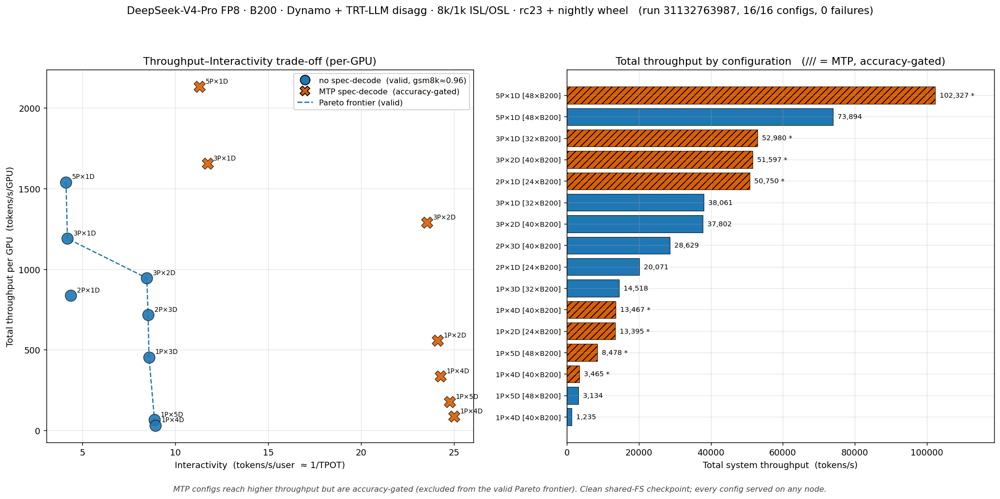

# DeepSeek-V4-Pro · B200 · Dynamo + TRT-LLM disagg · 8k/1k throughput frontier

Sweep `31132763987` — **16/16 configs, 0 failures** — TRT-LLM `release:1.3.0rc23` + Dynamo nightly wheel `1.4.0.dev20260730`, FP8 e4m3, ISL/OSL 8192/1024, sa-bench.

**Valid (non-MTP, production) frontier** — Pareto over these:

| Config | GPUs | Total tok/s | tok/s/GPU | Interactivity (tok/s/user) | mean TTFT (s) |
|---|---:|---:|---:|---:|---:|
| 5P×1D | 48 | 73,894 | 1,539 | 4.1 | 4.94 |
| 3P×1D | 32 | 38,061 | 1,189 | 4.2 | 2.88 |
| 3P×2D | 40 | 37,802 | 945 | 8.5 | 1.82 |
| 2P×3D | 40 | 28,629 | 716 | 8.5 | 2.09 |
| 2P×1D | 24 | 20,071 | 836 | 4.4 | 2.35 |
| 1P×3D | 32 | 14,518 | 454 | 8.6 | 2.28 |
| 1P×5D | 48 | 3,134 | 65 | 8.9 | 0.95 |
| 1P×4D | 40 | 1,235 | 31 | 8.9 | 2.48 |

**MTP (accuracy-gated — higher throughput but excluded from the valid frontier):**

| Config | GPUs | Total tok/s | tok/s/GPU | mean TTFT (s) |
|---|---:|---:|---:|---:|
| 5P×1D | 48 | 102,327 | 2,132 | 9.47 |
| 3P×1D | 32 | 52,980 | 1,656 | 2.07 |
| 3P×2D | 40 | 51,597 | 1,290 | 1.41 |
| 2P×1D | 24 | 50,750 | 2,115 | 1.66 |
| 1P×4D | 40 | 13,467 | 337 | 1.37 |
| 1P×2D | 24 | 13,395 | 558 | 1.30 |
| 1P×5D | 48 | 8,478 | 177 | 1.37 |
| 1P×4D | 40 | 3,465 | 87 | 1.26 |

_Left panel: throughput/GPU vs interactivity (1/TPOT). Right panel: total system throughput; hatched = MTP. Consistency: B200 2P×1D (none) here vs B300's 22,090 tok/s — as expected._
