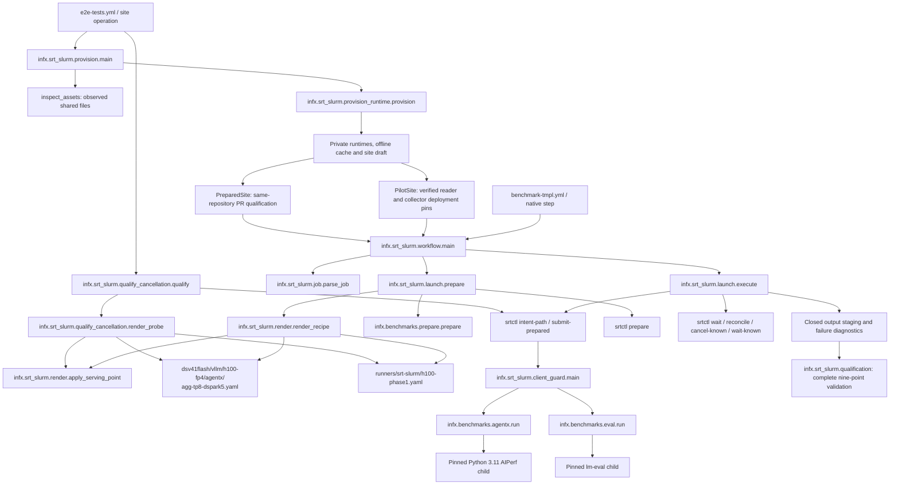

# Phase 1: prepared H100 aggregate execution

**English** | [中文](./srt-slurm-phase1_zh.md)

Phase 1 implements the first native srt-slurm lane. Hardware qualification, reader readiness, trusted collector deployment and publication remain open. The app reader was deployed and then rolled back at the user’s request; the additive database schema remains. See the ledger below. Passing local tests does not close this phase. The approved migration plan’s Phase 1 acceptance contract is restated below. The full plan and its research archive remain in the separate planning worktree.

## Scope and ownership

Only `dsv41flash-fp4-h100-vllm-agentic-dspark` uses the new `execution` reference. One exclusive H100 node runs one direct vLLM TP8 worker. Throughput uses c1,2,4,8,16,20,24,28; a separate c28 GSM8K job uses real verification. `--all-evals` also selects only c28 for this version-one native contract. The existing image, 1,048,576 context, 4096 batched tokens, five-token DSpark, 480-minute allocation and golden AL resource are preserved. Power telemetry is an explicit temporary parity exception; `require-power` is rejected.

The shared `utils/srt-slurm` gitlink remains unchanged. The pilot's separate `runtime-lock.json` pins its native source and dependency lock. NVIDIA and AMD reference checkouts remain clean. Native srt-slurm Bash templates, wrappers and setup scripts remain supported dependency code. Phase 1 does not port AMD, MoRI or ATOM.

```mermaid
flowchart LR
  M[Master execution reference] --> Q[Typed matrix and scheduling envelope]
  Q --> P[Prepare installed clients and offline assets]
  P --> B[Freeze recipe, profile, client and identities]
  B --> N[Native prepare: allocation and cardinality]
  N --> J[Native durable intent journal]
  J --> S[One exclusive Slurm allocation]
  S --> V[Direct vLLM TP8]
  V --> C[Python AgentX or real eval]
  C --> A[Raw and normalized artifacts]
  A --> D[PR qualification: nine-point diagnostic summary]
  A --> R[Publication path: trusted source receipt]
  R --> I[App validated import]
  R --> U[Later publication record]
  U --> I
```



The recipe follows the existing YAML hierarchy at [`agg-tp8-dspark5.yaml`](../benchmarks/multi_node/srt-slurm-recipes/dsv41flash/vllm/h100-fp4/agentx/agg-tp8-dspark5.yaml). Its runtime pin and client policy live in the same tree’s `configs/` directory: [`prepared-runtime-lock.json`](../benchmarks/multi_node/srt-slurm-recipes/configs/prepared-runtime-lock.json) and [`dsv41flash-agentx-client-policy.json`](../benchmarks/multi_node/srt-slurm-recipes/configs/dsv41flash-agentx-client-policy.json). The retained Bash recipe remains at `benchmarks/single_node/agentic/dsv41flash_fp4_h100_vllm_mtp.sh`.

## Call and file map

The recipe explicitly disables native tachometer telemetry. Native defaults otherwise launch DCGM, node/process exporters and a host scraper even when general observability is disabled. These unprovisioned services are outside the temporary Phase 1 power exception; AgentX still collects its required vLLM server metrics.



`ExecutionReference` binds recipe, profile, runtime lock, client policy and the policy's golden YAML bytes. Changed inputs, duplicate YAML keys, unsupported scope or missing explicit queue demand fail before allocation. `priority` and `queue-token` are scheduling metadata; they do not change the requested semantic point.

Preparation records the actual installed native/wrapper/client files, interpreter identities, plugin resolution, asset-path/content bindings, immutable model/dataset revisions and image bytes. The installed wrapper must match the selected checkout and must not be editable. `requested_point_id` identifies the requested row; `point_id` additionally binds these resolved identities. `bundle_digest` binds the full executable snapshot. `execution_id` identifies one repository/run/attempt/requested-point intent. Existing `recipe_fingerprint` remains the compatible matrix family label; native publication requires the stronger receipt identities.

## Provisioning before the first GPU run

The existing E2E dispatch accepts `phase1-site-operation: inspect`. It checks the explicit paths/revisions in `runners/srt-slurm/h100-phase1-provision.json` on an H100 login runner and preserves `inventory.json` as a run/attempt artifact. This operation enters the existing priority queue with `nodes:1`, submits no Slurm allocation, and does not modify the shared model or trace caches. The configuration comes from the retained H100 baseline; the report establishes which paths actually exist before runtime installation. Missing images, snapshots or weight shards fail inspection. The current preflight also requires `sbatch`, `squeue`, `sacct`, `scancel`, `srun` and `scontrol`. An inventory is not hardware qualification or a deployed-reader declaration.

`phase1-site-operation: provision` uses the same entry point to create a separate generation under the configured shared root. Supply the sweep’s exact PR merge SHA through the existing `ref` input so the installed wrapper matches the measured tree, including its current base revision. It installs the native runtime and exact-checkout wrapper noneditable, retains build/dependency identities, and prepares pinned AgentX/eval environments with private offline cache references. It preserves the existing model, image and trace payloads. Its output is a **site draft** using the strict `PreparedSite` schema. After provisioning succeeds, configure `INFX_H100_PHASE1_PREPARED_SITE_JSON` with that exact JSON to run PR qualification. Publication separately requires a `PilotSite` containing verified deployed reader/collector revisions. Candidate PR commits cannot serve as deployment pins. Provisioning also tests the installed eval backend and pinned AgentX tokenizer against the actual offline model snapshot before hashing the large assets.

The renderer also binds the actual engine TP/PP/context/data-parallel arguments to the requested topology before native preparation. Conflicting underscore/hyphen aliases, noninteger sizes and enabled expert parallelism fail closed.

Provision on shared Linux storage visible to the H100 login host and compute container. Do not reuse the macOS test environments. The native, wrapper and selected client interpreters, their standard libraries, installed distributions, native source, prepared bundles and client caches need explicit same-path mounts. Mount roots must be canonical paths; symlink aliases are rejected. Python 3.12 is required for native/wrapper execution and Python 3.11 for the pinned AgentX child. Outputs and writable caches must stay outside `/workspace`. The model's HF snapshot must retain access to its sibling blob directory. The native model argument preserves that full-cache mount.

1. Install the pinned native source using its committed `uv.lock` and a noneditable environment (`uv sync --frozen --no-editable --no-dev --python 3.12`). Keep that source checkout clean. Preserve the hashed Linux-built wheel and its build-tool constraints: `uv.lock` freezes runtime dependencies but does not pin the upstream Hatch build dependencies. If rebuilding, fetch and verify NVIDIA’s `v2.2.1` tag at `984180e5b8755aef85e9995048b5a16cb5336bce` to retain the same hatch-vcs version lineage.
2. Install a noneditable InferenceX wheel from the exact measured checkout into a shared Python 3.12 environment. Its installed package bytes are compared against the checkout before allocation.
3. Materialize separate client environments and retain their resolved package artifacts/locks. AgentX must come from `754356e9a39acc6cc6afb242d123bb57c3fb6f75`; lm-eval must come from `b315ef3b05176acc9732bb7fdec116abe1ecc476`. Editable and wrong-source installations are rejected. Preparation captures every installed distribution, not just the named entry point.
4. Materialize the complete model/tokenizer snapshot, exact `semianalysisai/cc-traces-weka-062126` snapshot and GSM8K cache. Capture their real revisions; do not invent or substitute a revision. The client’s offline model `refs/main` and snapshot files must be bound assets, and its resolved model snapshot must be the exact canonical serving snapshot. This preserves nominal tokenizer names without permitting a different cached revision. Private Hugging Face `refs/main` files contain exactly the revision bytes, with no trailing newline, as required by the actual cache reader. Prepare the unchanged serving image as a verified squash file and record its provenance/hash.
5. Write one `ClientSite` JSON for AgentX and one for eval. These explicitly provide the interpreter, distributions, offline cache environment, environment removals, asset roots/files, model snapshot, timeout and termination grace. `RuntimeSpec` rejects credentials; execution strips ambient credentials and unqualified AIPerf overrides. The packaged task and 1,319 independent document hashes are included in installed wheels.
6. Preserve the generated `PreparedSite` JSON with these two client-site paths, source/interpreter/model/image paths and mounts. For publication, extend it to `PilotSite` with actual deployed reader/collector revisions. The Pydantic models in [`render.py`](../infx/srt_slurm/render.py) and [`prepare.py`](../infx/benchmarks/prepare.py) are the exact schemas.

The downloaded trace snapshot alone does not satisfy AgentX's offline `datasets.load_dataset` call. Provision its nominal dataset repository at the explicit revision into the generation's private `HF_DATASETS_CACHE`, then verify a fresh offline nominal load against every row, in order, from the pinned snapshot. Include that prepared cache in the bound assets. A cache generated by loading a local directory has a different identity and cannot substitute for this check. The eval behavior probe also runs the same packaged lm-eval compatibility patch as the benchmark.

Preparation validates existing assets; it does not install packages, download models or repair incomplete snapshots on compute nodes. The derived mmap cache uses an owned namespace, file-integrity receipts, independent verified copies and corruption quarantine. Cold preparation on lock contention is explicit and bounded.

Before enabling publication, require a verified active app reader deployment, migration `016_measurement_snapshots.sql` and a deployed trusted collector. Configure `INFX_H100_PHASE1_SITE_JSON`, `INFX_PHASE1_READER_REVISION` and `INFX_PHASE1_COLLECTOR_REVISION` in InferenceX. Configure `INFX_RECEIPT_ISSUER_SHAS` and `INFX_RECEIPT_ISSUER_WORKFLOW` in both repositories; the workflow is `.github/workflows/phase1-receipt.yml`. `INFX_PHASE1_READER_REVISION` was removed after the app rollback; the site, collector and issuer settings remain pending. The reader is currently unavailable for native receipt ingestion, and publication remains gated. Retained schema reports and code on a source branch do not establish current reader readiness.

The PR sweep has an explicit qualification route for an isolated native matrix from a same-repository `pull_request` event. It uses the prepared-site variable and records `purpose: pr-qualification` in the source and executable bundle. It runs the unchanged eight throughput points and full real c28 eval. It emits `native-qualification-run`, nine `native-qualification-<point>` artifacts and a `native-qualification-summary`, with no normal benchmark/eval artifact names or `RESULT_FILENAME`. The summary revalidates bundle and member digests, execution and Slurm identities, native resources, AgentX raw/normalized results, and the complete scored GSM8K corpus. `complete: true` means this diagnostic sweep passed; `publication_eligible` remains false. Reuse, staging and receipt/publication validators reject qualification markers, including inventories mixed with normal artifacts. These results cannot later be promoted by approving the source run.

The GitHub native launch uses uv-managed Python 3.12 and an isolated checkout for each run, attempt and queue token; it does not require an ambient `python` command or repair shared Git state. The default publication route still checks the three site/deployment variables before preparation or Slurm allocation. Its error names missing variables, identifies invalid fields in the site JSON without echoing their values, and names reader/collector revision variables that disagree with the site configuration. Neither route installs assets or deploys services during a benchmark.

## Preparation, execution and recovery

The standalone adapter accepts explicit files:

```text
python -m infx.srt_slurm.launch --job job.json --site site.json --root CHECKOUT --source source.json --prepare-only
python -m infx.srt_slurm.launch --job job.json --site site.json --root CHECKOUT --source source.json
```

`job.json` contains the generated row plus explicit `priority`, `queue-token` and `node-count: 1`. `source.json` contains `repository`, numeric `run_id`, numeric `attempt` and the full measured `head_sha`. Do not manufacture GitHub run identity. `--prepare-only` performs no allocation. Independently inspect and retain these prepared expectations before running the corresponding points; a worker's later `execution.json` is evidence to compare, not authority for expected identities.

Native preparation must resolve exactly `{nodes:1,gpus_per_node:8,serving_gpus:8,workers:1,cardinality:1}`. Throughput renders synthetic rejection from the committed golden curve with adaptive verification off. Eval renders real block rejection with adaptive verification on. Direct port 8000 is an explicit exclusive-node policy: a bind collision is a failure, not permission to contact another server.

Slurm allocation, claims, accepted IDs, scheduler observation and cancellation belong to the native runtime. The adapter obtains the journal path before the interruptible submit. It never repeats an ambiguous submission or cancels by runner name. Active controller state takes precedence over stale accounting; a failed-but-active requeue is not closed. Known owned allocations are cancelled and observed to terminal closure with bounded waits. Repeated catchable signals are ignored during that bounded cleanup and the original handlers are restored afterward. A forced process kill or host loss can still interrupt cleanup; the durable journal remains available for native reconciliation. An unresolved intent stays fenced for inspection.

Successful publication requires both native terminal success and a closed client audit with no error, timeout, signal or orphaned writer. Failure diagnostics retain raw outputs, client audit, frozen inputs and native logs without producing an accepted execution manifest. The broad legacy pre/post runner cleanup is skipped for this lane. The legacy H100 launcher/script remains available for rollback until qualification and a reviewed retirement diff.

## Measurement receipt and publication

Before accepting a sweep, qualify real cancellation through the E2E `cancel-startup` and `cancel-client` site operations. Supply the actual provisioned `phase1-site-draft` path. They use separate diagnostic output/journals, the pinned image and TP8 worker, and native ownership-aware cancellation; they do not fabricate deployment pins or produce accepted benchmark manifests. Startup uses a 300-second allocation with a 240-second observation budget. Client interruption uses a 3,600-second allocation with a 3,300-second observation budget so model readiness can complete. Each has a separate 180-second cleanup budget. Preserve the resulting `qualification.json` and native terminal/writer evidence; a cancellation RPC or `COMPLETING` alone is insufficient.

Both probes use the real c28 eval serving settings through the same `apply_serving_point` renderer as benchmark execution: `max-num-seqs: 56`, `max-cudagraph-capture-size: 512`, and DSpark with real block rejection and adaptive verification. The model, image, TP8 topology, `max-model-len: 1048576` and `max-num-batched-tokens: 4096` remain unchanged. The diagnostic client is still a literal Python signal-aware writer. `qualification.json` records this serving point; the probe does not run or publish an eval. Matching these settings corrects the previous reliance on vLLM's sequence defaults, but does not prove the observed CUDA initialization failure is fixed.

The [H100 observer run 35483966784](https://github.com/SemiAnalysisAI/InferenceX/actions/runs/35483966784) confirmed Slurm `25.05.7`, `StepMgrEnabled=Yes` for owned job `18325`, and `enable_stepmgr` in the controller configuration. During the preceding startup probe, `squeue --steps` exposed only `batch` and `extern` despite a running aggregate step. Candidate native pin `62beb5ec4f8c33abc26851ba0adaded29957ca5b` queries `scontrol --oneliner show steps <owned-job-id>` and validates the returned job, step name and running state. This is a native observation/cleanup correction; it does not relax the requirement for an actual aggregate step plus worker identity. The observer ran after job `18325` ended, so its empty step listing is not live-worker verification. The candidate pin and c28 probe settings still require an actual rerun.

The native pin now requires `prepared-direct-listener-ownership-v1`. Before client traffic, it verifies the listening socket belongs to the recorded worker process tree, using PID start times and PID/network namespace identities. It repeats ownership checks during the client and before accepting exit 0. A foreign/replaced listener, reused PID or inaccessible ownership evidence fails the job and closes the client. Actual Pyxis namespace/proc visibility is part of cluster qualification.

The complete source contract is eight throughput points and one real c28 eval. GSM8K requires all 1,319 documents and both filters (2,638 scored rows), the preserved 16,384 context / 12,288 generation budgets, finite scores and complete sample identities. Aggregate eval metadata has `disagg:false`, `is_multinode:false`, eight serving GPUs and zero prefill/decode worker counts.

1. Create a reviewed `qualification/phase1/*.json` expectation using the `Approval` schema in [`phase1_publication.py`](../infx/workflows/phase1_publication.py). Copy point/execution/bundle/native-manifest identities from the independently prepared control records, not worker archives. Require the complete nine-point set and actual corpus revision.
2. Run `phase1-receipt.yml` on `main` with `kind: measurement`. Trusted code resolves exact source artifact IDs, verifies API ownership/run/attempt, ZIP digest and safe members, then validates execution identity, normalized metrics/config/topology/dataset and raw eval coverage before sealing `receipt.json`.
3. Staging resolves the accepted receipt through the deployed issuer allowlist. Missing native receipts fail closed. The app verifies the snapshot before database writes or a staging reset; partial import resumes only the same immutable source receipt.
4. After the reviewed merge/publication run completes, approve a `PublicationRecord` JSON linking the original receipt artifact/digest, merge SHA/run, changelog artifact/digest and deployed app/ingest revision. Run the same issuer with `kind: publication`. The original source receipt is not rewritten.
5. Use the supported staging/recovery dispatch. Automatic main ingest defers while required source/publication sealing is pending; it never falls back to legacy native ingestion. Recovery carries exact receipt and publication references. App checks include exact-run and latest curves, trace detail, aggregate topology and strict-filter eval visibility.

The merge helper preserves the latest explicit authorized `/use RUN_ID` (or `/reuse-sweep-run RUN_ID`). A newer diagnostic run cannot silently replace it. Unavailable authorized evidence requires an explicit new decision.

## Qualification ledger

Historical evidence: app [PR1179](https://github.com/SemiAnalysisAI/InferenceX-app/pull/1179) was normally squash-merged to `481a8622cc9bc27feae775850e241ec967bac1e3` after 6,892 unit, 486 component and 1,033 integration tests per browser passed, with a clean Bugbot review. Migration 016 and its schema verification passed on [staging](https://github.com/SemiAnalysisAI/InferenceX-app/actions/runs/35478033492) and [production](https://github.com/SemiAnalysisAI/InferenceX-app/actions/runs/35478066182). Vercel Production deployment `6547210249` succeeded for that exact SHA. These reports remain valid evidence of the schema operations performed at that revision.

Current readiness: at the user’s request, Vercel Instant Rollback restored production to `9bb7b13eb4985217a6282f340459fd5948613276` ([deployment](https://inferencemax-7ecuqzeqm-semianalysisai.vercel.app) `dpl_8H2dnpuKFDZhwe6pU7tb657pu5z3`), and `INFX_PHASE1_READER_REVISION` was removed. The exact code revert, [PR1180](https://github.com/SemiAnalysisAI/InferenceX-app/pull/1180), was merged with explicit user approval at `2026-09-20T00:29:48Z`; `master` is now `92fef485edd5ae61fe49d01f0e41b67492263bee`, whose tree exactly matches the pre-PR1179 revision `9bb7b13eb4985217a6282f340459fd5948613276`. The user subsequently reported that automatic production promotion was re-enabled. This does not restore the reverted reader code or its removed readiness variable. All other PR merges remain prohibited by the current user instruction. The additive `measurement_snapshots` table and migration ledger are retained. The Phase 1 reader is unavailable, so native receipt ingestion and publication remain gated. No Phase 1 native receipt or measurement has been imported. Collector [PR3298](https://github.com/SemiAnalysisAI/InferenceX/pull/3298) also remains open and subject to the repository’s Core/CODEOWNER approval requirements.

[H100 inventory run 35477700047](https://github.com/SemiAnalysisAI/InferenceX/actions/runs/35477700047) passed on an actual login runner at `14d56f1bbf8f3c867ea79ae97a2f716f304aaaa2`. Both pinned snapshots and all indexed model shards exist at the configured canonical shared paths; the serving squash file is 21,390,860,288 bytes, and the four required Slurm commands are present. [CI 35477693002](https://github.com/SemiAnalysisAI/InferenceX/actions/runs/35477693002) passed the updated topology and inventory behavior plus the native Linux contract. Neither run submitted a GPU benchmark.

The first allocated lifecycle probes used InferenceX `bc0710934f3ca2dbdd37940aa93c91a5002e5061` and native `50c3dacc37def01606ee9e4e0ed873646d4f7cc5`. [Startup run 35483589637](https://github.com/SemiAnalysisAI/InferenceX/actions/runs/35483589637) accepted job `18324`; its TP8 worker ran as step `18324.5`. The probe timed out because step discovery missed that worker, then cancelled the exact owned allocation. Retained logs show SIGTERM, and native observation confirms terminal `CANCELLED` with cleanup complete. This proves owned cancellation and closure, but the requested startup trigger did not qualify.

[Client run 35483590787](https://github.com/SemiAnalysisAI/InferenceX/actions/runs/35483590787) accepted job `18325`, whose vLLM worker failed during DSpark initialization with CUDA index-out-of-bounds/device-assert errors. Native observation confirms terminal `FAILED` and completed cleanup; cancellation found the allocation already terminal. No diagnostic writer started, so there is no intended client-interruption or closed-writer evidence. Both runs retain `lifecycle_qualified: false`. The c28 serving-parity and native step-discovery fixes need fresh hardware verification; neither failed run qualifies a lifecycle gate or establishes a sweep outcome.

| Gate | Status / required evidence |
| --- | --- |
| Native and client behavior | CPU tests and installed-wheel checks; no GPU claim |
| Receipt, app and recovery | Reader rolled back and revision variable removed; additive schema retained; native receipt import and publication gated |
| H100 throughput | c1,2,4,8,16,20,24,28 pending on the unchanged image |
| Real evaluation | New c28 run pending; historical full raw eval passes validator |
| Cancellation/cleanup | Job `18324` reached owned `CANCELLED` closure but missed its trigger; job `18325` failed initialization before the writer; both lifecycle qualifications remain pending |
| Measurement equivalence | Compare qualified metrics, failures, warmup/drain, server settings and raw schemas against the retained baseline |
| Publication | Trusted receipt, later publication record and refreshed app evidence pending |
| Power | Explicit temporary parity exception; measured power not claimed |
| Retirement | Legacy H100 script retained pending all exit evidence |

GitHub [CI run 35476764022](https://github.com/SemiAnalysisAI/InferenceX/actions/runs/35476764022) verified commit `4e44348ee1bc46b23297f88e1343137597cb011d`: 1,871 Python tests and 2,458 native Linux tests passed, together with the installed-runtime check covering all nine points. [Sweep 35476764181](https://github.com/SemiAnalysisAI/InferenceX/actions/runs/35476764181) reached the H100 runners using managed Python 3.12, then stopped before Slurm submission because `INFX_H100_PHASE1_SITE_JSON`, `INFX_PHASE1_READER_REVISION` and `INFX_PHASE1_COLLECTOR_REVISION` were unset. This is a verified provisioning/deployment prerequisite failure, not H100 throughput or eval qualification.

Record actual InferenceX/native/collector/app commits, source run/attempt, prepared expectation, nine artifact bindings, source receipt, publication record and app verification report in this ledger when available. No fabricated IDs or placeholder success entries may close a gate.
