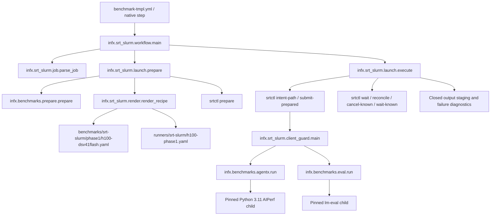

# Phase 1: prepared H100 aggregate execution

**English** | [中文](./srt-slurm-phase1_zh.md)

Phase 1 implements the first native srt-slurm lane. Hardware qualification, reader deployment and publication remain open. Passing local tests does not close this phase. The approved migration plan’s Phase 1 acceptance contract is restated below. The full plan and its research archive remain in the separate planning worktree.

## Scope and ownership

Only `dsv41flash-fp4-h100-vllm-agentic-dspark` uses the new `execution` reference. One exclusive H100 node runs one direct vLLM TP8 worker. Throughput uses c1,2,4,8,16,20,24,28; a separate c28 GSM8K job uses real verification. `--all-evals` also selects only c28 for this version-one native contract. The existing image, 1,048,576 context, 4096 batched tokens, five-token DSpark, 480-minute allocation and golden AL resource are preserved. Power telemetry is an explicit temporary parity exception; `require-power` is rejected.

The shared `utils/srt-slurm` gitlink remains unchanged. The pilot's separate `runtime-lock.json` pins its native source and dependency lock. NVIDIA and AMD reference checkouts remain clean. Native srt-slurm Bash templates, wrappers and setup scripts remain supported dependency code. Phase 1 does not port AMD, MoRI or ATOM.

```mermaid
flowchart LR
  M[Master execution reference] --> Q[Typed matrix and scheduling envelope]
  Q --> P[Prepare installed clients and offline assets]
  P --> B[Freeze recipe, profile, client and identities]
  B --> N[Native prepare: allocation and cardinality]
  N --> J[Native durable intent journal]
  J --> S[One exclusive Slurm allocation]
  S --> V[Direct vLLM TP8]
  V --> C[Python AgentX or real eval]
  C --> A[Raw and normalized artifacts]
  A --> R[Trusted source receipt]
  R --> I[App validated import]
  R --> U[Later publication record]
  U --> I
```



## Call and file map



`ExecutionReference` binds recipe, profile, runtime lock, client policy and the policy's golden YAML bytes. Changed inputs, duplicate YAML keys, unsupported scope or missing explicit queue demand fail before allocation. `priority` and `queue-token` are scheduling metadata; they do not change the requested semantic point.

Preparation records the actual installed native/wrapper/client files, interpreter identities, plugin resolution, asset-path/content bindings, immutable model/dataset revisions and image bytes. The installed wrapper must match the selected checkout and must not be editable. `requested_point_id` identifies the requested row; `point_id` additionally binds these resolved identities. `bundle_digest` binds the full executable snapshot. `execution_id` identifies one repository/run/attempt/requested-point intent. Existing `recipe_fingerprint` remains the compatible matrix family label; native publication requires the stronger receipt identities.

## Provisioning before the first GPU run

Provision on shared Linux storage visible to the H100 login host and compute container. Do not reuse the macOS test environments. The native, wrapper and selected client interpreters, their standard libraries, installed distributions, native source, prepared bundles and client caches need explicit same-path mounts. Mount roots must be canonical paths; symlink aliases are rejected. Python 3.12 is required for native/wrapper execution and Python 3.11 for the pinned AgentX child. Outputs and writable caches must stay outside `/workspace`. The model's HF snapshot must retain access to its sibling blob directory. The native model argument preserves that full-cache mount.

1. Install the pinned native source using its committed `uv.lock` and a noneditable environment (`uv sync --frozen --no-editable --no-dev --python 3.12`). Keep that source checkout clean. Preserve the hashed Linux-built wheel and its build-tool constraints: `uv.lock` freezes runtime dependencies but does not pin the upstream Hatch build dependencies. If rebuilding, fetch and verify NVIDIA’s `v2.2.1` tag at `984180e5b8755aef85e9995048b5a16cb5336bce` to retain the same hatch-vcs version lineage.
2. Install a noneditable InferenceX wheel from the exact measured checkout into a shared Python 3.12 environment. Its installed package bytes are compared against the checkout before allocation.
3. Materialize separate client environments and retain their resolved package artifacts/locks. AgentX must come from `754356e9a39acc6cc6afb242d123bb57c3fb6f75`; lm-eval must come from `b315ef3b05176acc9732bb7fdec116abe1ecc476`. Editable and wrong-source installations are rejected. Preparation captures every installed distribution, not just the named entry point.
4. Materialize the complete model/tokenizer snapshot, exact `semianalysisai/cc-traces-weka-062126` snapshot and GSM8K cache. Capture their real revisions; do not invent or substitute a revision. The client’s offline model `refs/main` and snapshot files must be bound assets, and its resolved model snapshot must be the exact canonical serving snapshot. This preserves nominal tokenizer names without permitting a different cached revision. Prepare the unchanged serving image as a verified squash file and record its provenance/hash.
5. Write one `ClientSite` JSON for AgentX and one for eval. These explicitly provide the interpreter, distributions, offline cache environment, environment removals, asset roots/files, model snapshot, timeout and termination grace. `RuntimeSpec` rejects credentials; execution strips ambient credentials and unqualified AIPerf overrides. The packaged task and 1,319 independent document hashes are included in installed wheels.
6. Write the `PilotSite` JSON with these two client-site paths, source/interpreter/model/image paths, mounts and actual deployed reader/collector revisions. The Pydantic models in [`render.py`](../infx/srt_slurm/render.py) and [`prepare.py`](../infx/benchmarks/prepare.py) are the exact schemas.

Preparation validates existing assets; it does not install packages, download models or repair incomplete snapshots on compute nodes. The derived mmap cache uses an owned namespace, file-integrity receipts, independent verified copies and corruption quarantine. Cold preparation on lock contention is explicit and bounded.

Before enabling sweeps, deploy the app reader and migration `016_measurement_snapshots.sql`, then land/deploy the trusted collector. Configure `INFX_H100_PHASE1_SITE_JSON`, `INFX_PHASE1_READER_REVISION` and `INFX_PHASE1_COLLECTOR_REVISION` in InferenceX. Configure `INFX_RECEIPT_ISSUER_SHAS` and `INFX_RECEIPT_ISSUER_WORKFLOW` in both repositories; the workflow is `.github/workflows/phase1-receipt.yml`. These values are absent in the inspected repository configuration. A source branch containing the code alone is not a deployed reader.

## Preparation, execution and recovery

The standalone adapter accepts explicit files:

```text
python -m infx.srt_slurm.launch --job job.json --site site.json --root CHECKOUT --source source.json --prepare-only
python -m infx.srt_slurm.launch --job job.json --site site.json --root CHECKOUT --source source.json
```

`job.json` contains the generated row plus explicit `priority`, `queue-token` and `node-count: 1`. `source.json` contains `repository`, numeric `run_id`, numeric `attempt` and the full measured `head_sha`. Do not manufacture GitHub run identity. `--prepare-only` performs no allocation. Independently inspect and retain these prepared expectations before running the corresponding points; a worker's later `execution.json` is evidence to compare, not authority for expected identities.

Native preparation must resolve exactly `{nodes:1,gpus_per_node:8,serving_gpus:8,workers:1,cardinality:1}`. Throughput renders synthetic rejection from the committed golden curve with adaptive verification off. Eval renders real block rejection with adaptive verification on. Direct port 8000 is an explicit exclusive-node policy: a bind collision is a failure, not permission to contact another server.

Slurm allocation, claims, accepted IDs, scheduler observation and cancellation belong to the native runtime. The adapter obtains the journal path before the interruptible submit. It never repeats an ambiguous submission or cancels by runner name. Active controller state takes precedence over stale accounting; a failed-but-active requeue is not closed. Known owned allocations are cancelled and observed to terminal closure with bounded waits. An unresolved intent stays fenced for inspection.

Successful publication requires both native terminal success and a closed client audit with no error, timeout, signal or orphaned writer. Failure diagnostics retain raw outputs, client audit, frozen inputs and native logs without producing an accepted execution manifest. The broad legacy pre/post runner cleanup is skipped for this lane. The legacy H100 launcher/script remains available for rollback until qualification and a reviewed retirement diff.

## Measurement receipt and publication

The complete source contract is eight throughput points and one real c28 eval. GSM8K requires all 1,319 documents and both filters (2,638 scored rows), the preserved 16,384 context / 12,288 generation budgets, finite scores and complete sample identities. Aggregate eval metadata has `disagg:false`, `is_multinode:false`, eight serving GPUs and zero prefill/decode worker counts.

1. Create a reviewed `qualification/phase1/*.json` expectation using the `Approval` schema in [`phase1_publication.py`](../infx/workflows/phase1_publication.py). Copy point/execution/bundle/native-manifest identities from the independently prepared control records, not worker archives. Require the complete nine-point set and actual corpus revision.
2. Run `phase1-receipt.yml` on `main` with `kind: measurement`. Trusted code resolves exact source artifact IDs, verifies API ownership/run/attempt, ZIP digest and safe members, then validates execution identity, normalized metrics/config/topology/dataset and raw eval coverage before sealing `receipt.json`.
3. Staging resolves the accepted receipt through the deployed issuer allowlist. Missing native receipts fail closed. The app verifies the snapshot before database writes or a staging reset; partial import resumes only the same immutable source receipt.
4. After the reviewed merge/publication run completes, approve a `PublicationRecord` JSON linking the original receipt artifact/digest, merge SHA/run, changelog artifact/digest and deployed app/ingest revision. Run the same issuer with `kind: publication`. The original source receipt is not rewritten.
5. Use the supported staging/recovery dispatch. Automatic main ingest defers while required source/publication sealing is pending; it never falls back to legacy native ingestion. Recovery carries exact receipt and publication references. App checks include exact-run and latest curves, trace detail, aggregate topology and strict-filter eval visibility.

The merge helper preserves the latest explicit authorized `/use RUN_ID` (or `/reuse-sweep-run RUN_ID`). A newer diagnostic run cannot silently replace it. Unavailable authorized evidence requires an explicit new decision.

## Qualification ledger

| Gate | Status / required evidence |
| --- | --- |
| Native and client behavior | CPU tests and installed-wheel checks; no GPU claim |
| Receipt, app and recovery | Local unit, database and browser smoke checks; deployment pending |
| H100 throughput | c1,2,4,8,16,20,24,28 pending on the unchanged image |
| Real evaluation | New c28 run pending; historical full raw eval passes validator |
| Cancellation/cleanup | Local ownership/race/closure tests; real Slurm signal qualification pending |
| Measurement equivalence | Compare qualified metrics, failures, warmup/drain, server settings and raw schemas against the retained baseline |
| Publication | Trusted receipt, later publication record and refreshed app evidence pending |
| Power | Explicit temporary parity exception; measured power not claimed |
| Retirement | Legacy H100 script retained pending all exit evidence |

Record actual InferenceX/native/collector/app commits, source run/attempt, prepared expectation, nine artifact bindings, source receipt, publication record and app verification report in this ledger when available. No fabricated IDs or placeholder success entries may close a gate.
