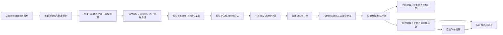
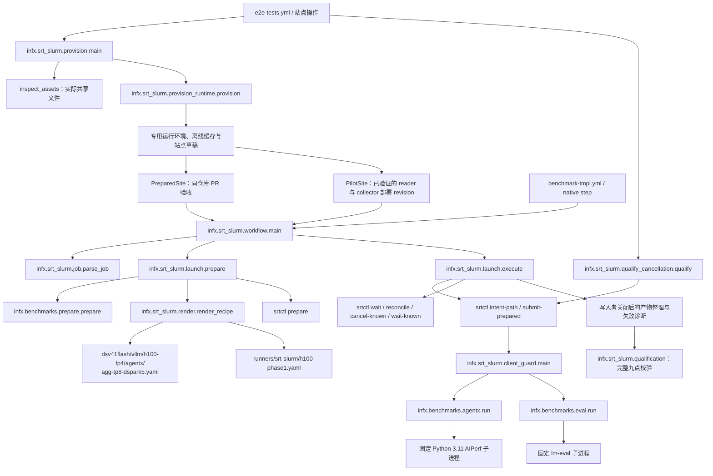

# 阶段 1：预备式 H100 聚合执行

[English](./srt-slurm-phase1.md) | **中文**

阶段 1 实现首条原生 srt-slurm 路径。硬件验收、reader 就绪、可信 collector 部署与发布仍待完成。app reader 曾完成部署，随后按用户要求回滚；新增数据库 schema 仍保留，详见下方账本。本地测试通过不代表阶段结束。下文重述已批准迁移计划中阶段 1 的验收要求。完整计划及研究资料仍保留在独立的规划 worktree。

## 范围与职责

只有 `dsv41flash-fp4-h100-vllm-agentic-dspark` 使用新的 `execution` 引用。一台独占 H100 节点运行一个直连 vLLM TP8 worker。吞吐并发为 c1、2、4、8、16、20、24、28；另有 c28 GSM8K 真实验证任务。`--all-evals` 对该版本 1 原生契约也仅选择 c28。保留现有镜像、1,048,576 上下文、4096 batched tokens、五 token DSpark、480 分钟分配以及 golden AL 资源。功耗遥测是明确的临时一致性例外；拒绝 `require-power`。

共享 `utils/srt-slurm` gitlink 不变。试点通过独立 `runtime-lock.json` 固定原生源代码与依赖锁。NVIDIA、AMD 参考仓库保持干净。原生 srt-slurm 的 Bash 模板、包装器及安装脚本仍属于允许保留的依赖代码。本阶段不迁移 AMD、MoRI 或 ATOM。



配方沿用现有 YAML 层级，位于 [`agg-tp8-dspark5.yaml`](../benchmarks/multi_node/srt-slurm-recipes/dsv41flash/vllm/h100-fp4/agentx/agg-tp8-dspark5.yaml)。运行时 pin 与客户端策略位于同一配方树的 `configs/` 下：[`prepared-runtime-lock.json`](../benchmarks/multi_node/srt-slurm-recipes/configs/prepared-runtime-lock.json) 和 [`dsv41flash-agentx-client-policy.json`](../benchmarks/multi_node/srt-slurm-recipes/configs/dsv41flash-agentx-client-policy.json)。旧 Bash 配方仍位于 `benchmarks/single_node/agentic/dsv41flash_fp4_h100_vllm_mtp.sh`。

## 调用与文件关系

配方显式关闭原生 tachometer 遥测。即使通用 observability 关闭，原生默认设置仍会启动 DCGM、node/process exporter 和主机 scraper。这些未部署的服务不属于阶段 1 的临时功耗例外；AgentX 仍会采集必需的 vLLM 服务指标。



`ExecutionReference` 绑定配方、profile、runtime lock、client policy 以及 policy 指向的 golden YAML 字节。输入发生变化、YAML 重复键、超出范围或缺少明确排队节点需求，均在分配前失败。`priority` 与 `queue-token` 仅属于调度信息，不改变请求测量点。

准备阶段记录实际安装的原生运行时、wrapper、客户端文件，解释器身份、插件解析、资源路径与内容绑定、不可变模型/数据集 revision、镜像字节。已安装 wrapper 必须与所选 checkout 一致，且不可为 editable。`requested_point_id` 标识请求行；`point_id` 进一步绑定解析后的实际身份；`bundle_digest` 绑定完整可执行快照；`execution_id` 标识一次仓库/run/attempt/请求点 intent。现有 `recipe_fingerprint` 继续用于兼容矩阵 family；原生发布必须验证更强的回执身份。

## 首次 GPU 运行前的部署

现有 E2E 手动调度支持 `phase1-site-operation: inspect`，在 H100 登录 runner 上检查 `runners/srt-slurm/h100-phase1-provision.json` 显式提供的路径和 revision，并将 `inventory.json` 保存为绑定运行及 attempt 的 artifact。此操作以 `nodes:1` 进入现有优先级队列，不提交 Slurm allocation，也不修改共享模型或 trace 缓存。配置来自保留的 H100 基线；检查报告用于在安装运行环境之前确认实际存在的路径。镜像、快照或权重分片缺失会使检查失败。当前预检还要求 `sbatch`、`squeue`、`sacct`、`scancel`、`srun` 和 `scontrol` 全部可用。资源清单不代表硬件验收完成，也不代表 reader 已部署。

`phase1-site-operation: provision` 通过同一入口，在配置的共享根目录下建立独立 generation。通过已有 `ref` 输入提供 sweep 实际使用的完整 PR merge SHA，使已安装 wrapper 与包含当前 base revision 的测量代码树一致。它以非 editable 方式安装原生运行时和当前 checkout 的 wrapper，保留构建及依赖身份，并为固定版本的 AgentX/eval 建立运行环境与专用离线缓存引用。现有模型、镜像和 trace 内容保持不变。输出是使用严格 `PreparedSite` schema 的**站点草稿**。准备成功后，将完整的实际 JSON 配置为 `INFX_H100_PHASE1_PREPARED_SITE_JSON`，即可执行 PR 验收。发布另需 `PilotSite`，其中的 reader/collector revision 必须来自已验证的实际部署，不能使用候选 PR 提交替代。准备过程还会在大型资源哈希计算前，使用实际离线模型快照检查已安装的 eval backend 及固定 AgentX tokenizer。

渲染器还会在原生准备步骤之前，将引擎实际 TP/PP/上下文/数据并行参数与请求的拓扑绑定。下划线与连字符别名冲突、非整数并行度或启用专家并行都会被拒绝。

在 H100 登录节点与计算容器均可访问的共享 Linux 存储上部署，不复用 macOS 测试环境。原生、wrapper 及所选客户端的 Python 解释器、标准库、已安装依赖、原生源代码、prepared bundle 与客户端缓存均需明确的同路径挂载。挂载根目录必须是规范路径，不接受符号链接别名。原生及 wrapper 使用 Python 3.12，固定的 AgentX 子进程使用 Python 3.11。输出与可写缓存不得放在 `/workspace` 下。HF 模型 snapshot 必须仍能访问相邻 blob 目录；原生模型参数会保留完整缓存路径。

1. 使用原生源代码提交中的 `uv.lock` 安装非 editable 环境：`uv sync --frozen --no-editable --no-dev --python 3.12`。保持该源码 checkout 干净。保留带哈希的 Linux wheel 及构建工具约束：`uv.lock` 固定运行依赖，但未固定上游 Hatch 构建依赖。重新构建时，获取并核实 NVIDIA 的 `v2.2.1` tag 指向 `984180e5b8755aef85e9995048b5a16cb5336bce`，保留相同 hatch-vcs 版本谱系。
2. 从实际测量 checkout 构建并安装非 editable InferenceX wheel，使用共享 Python 3.12 环境。分配前逐文件比较已安装包与 checkout。
3. 准备独立客户端环境并保留实际解析的包产物与锁。AgentX 必须来自 `754356e9a39acc6cc6afb242d123bb57c3fb6f75`；lm-eval 必须来自 `b315ef3b05176acc9732bb7fdec116abe1ecc476`。拒绝 editable 或错误来源。准备阶段记录所有已安装 distribution，而非仅入口包。
4. 完整准备模型/tokenizer snapshot、准确的 `semianalysisai/cc-traces-weka-062126` snapshot 与 GSM8K 缓存。记录真实 revision，不编造或替换。准备原样服务镜像的已校验 squash 文件，记录来源和哈希。客户端离线模型的 `refs/main` 与 snapshot 文件必须纳入资源绑定，解析后的模型 snapshot 必须与服务端的规范路径完全一致，保留 tokenizer 的模型名称同时禁止解析到其他缓存版本。私有 Hugging Face `refs/main` 文件只包含 revision 字节，不带尾部换行，符合实际缓存 reader 的要求。
5. 分别编写 AgentX、eval 的 `ClientSite` JSON：解释器、distribution、离线缓存环境、移除变量、资源根目录/文件、模型 snapshot、超时与终止宽限。`RuntimeSpec` 拒绝凭证；执行时移除继承凭证及未验收的 AIPerf 覆盖项。wheel 包含 eval task 与 1,319 个独立文档哈希。
6. 保留生成的 `PreparedSite` JSON，包含两个客户端配置路径、源码/解释器/模型/镜像路径及挂载。发布时再添加实际部署的 reader/collector revision，形成 `PilotSite`。准确 schema 见 [`render.py`](../infx/srt_slurm/render.py) 与 [`prepare.py`](../infx/benchmarks/prepare.py)。

仅有下载好的 trace snapshot，无法满足 AgentX 离线调用 `datasets.load_dataset` 的要求。准备时须用数据集的标准仓库名称及明确 revision，在该 generation 的私有 `HF_DATASETS_CACHE` 中生成缓存；随后启动新的离线进程，通过标准仓库名称加载，并按顺序逐行与固定 snapshot 比较。生成的缓存也须纳入资源绑定。通过本地目录加载生成的缓存具有不同身份，不能替代上述检查。eval 行为探测也会执行与正式 benchmark 相同的、随包分发的 lm-eval 兼容补丁。

准备阶段校验已有资源，不在计算节点安装包、下载模型或修复不完整 snapshot。派生 mmap 缓存使用独立所属 namespace、文件完整性回执、独立校验副本及损坏隔离；锁竞争时的冷准备有明确界限。

启用发布前，必须确认 app reader 当前部署已验证、`016_measurement_snapshots.sql` migration 已完成且受信任 collector 已部署。InferenceX 需配置 `INFX_H100_PHASE1_SITE_JSON`、`INFX_PHASE1_READER_REVISION`、`INFX_PHASE1_COLLECTOR_REVISION`。两个仓库均需配置 `INFX_RECEIPT_ISSUER_SHAS`、`INFX_RECEIPT_ISSUER_WORKFLOW`，workflow 路径为 `.github/workflows/phase1-receipt.yml`。app 回滚后已删除 `INFX_PHASE1_READER_REVISION`；站点、collector 与 issuer 设置仍待完成。当前 reader 无法用于原生回执导入，发布仍受门禁限制。保留的 schema 报告和源分支中的代码都不能证明当前 reader 已就绪。

PR sweep 为同仓库 `pull_request` 事件的独立原生矩阵提供明确的验收路径。该路径读取 prepared-site 变量，在 source 与可执行 bundle 中记录 `purpose: pr-qualification`，保持原有八个吞吐点及完整真实 c28 eval 不变。它只产生 `native-qualification-run`、九个 `native-qualification-<point>` artifact 和 `native-qualification-summary`，不产生普通 benchmark/eval artifact 名称或 `RESULT_FILENAME`。汇总重新校验 bundle 与成员摘要、执行及 Slurm 身份、原生资源、AgentX 原始及规范化结果，以及完整评分的 GSM8K 语料。`complete: true` 表示本次诊断 sweep 通过，`publication_eligible` 仍为 false。Reuse、staging、回执和 publication validator 会拒绝含验收标记的来源，包括混合了普通 artifact 的清单。之后批准该源 run 也不能将这些结果提升为可发布测量。

GitHub 原生启动步骤使用 uv 管理的 Python 3.12，并为每个 run、attempt 和 queue token 建立独立 checkout；不依赖环境中已有的 `python` 命令，也不修复共享 Git 状态。默认发布路径仍在准备或申请 Slurm 资源前校验三个站点/部署变量。错误会列出缺失变量，指出站点 JSON 的无效字段而不回显字段值，并列出与站点配置不一致的 reader/collector revision 变量。两条路径都不会在 benchmark 中安装资源或部署服务。

## 准备、执行与恢复

独立适配器接收明确的文件参数：

```text
python -m infx.srt_slurm.launch --job job.json --site site.json --root CHECKOUT --source source.json --prepare-only
python -m infx.srt_slurm.launch --job job.json --site site.json --root CHECKOUT --source source.json
```

`job.json` 包含生成的矩阵行及明确的 `priority`、`queue-token`、`node-count: 1`。`source.json` 包含 `repository`、数值 `run_id`、数值 `attempt`、完整测量 `head_sha`。不得编造 GitHub run 身份。`--prepare-only` 不申请资源。运行对应测量点前，独立检查并保留准备期预期；worker 后来的 `execution.json` 只用于对照，不能成为预期身份的权威来源。

原生准备必须解析为 `{nodes:1,gpus_per_node:8,serving_gpus:8,workers:1,cardinality:1}`。吞吐从已提交 golden 曲线渲染 synthetic rejection，关闭 adaptive verification；eval 使用真实 block rejection，开启 adaptive verification。直连端口 8000 采用明确的独占节点策略：端口冲突即失败，不能连接其他服务器。

Slurm 分配、claim、已接受 ID、调度器观察与取消均由原生运行时负责。适配器在可中断 submit 前取得日志路径，不重试不明确的提交，也不按 runner 名批量取消。活跃 controller 状态优先于陈旧 accounting；失败但仍活跃的 requeue 不算关闭。取消所有已确认属于该 intent 的资源，并在有界等待内观察终止。在这段有界清理期间忽略重复的可捕获信号，结束后恢复原处理器。强制终止进程或主机故障仍可能中断清理；持久化 journal 保留，供原生 reconcile 恢复。未解决的 intent 保持 fenced，等待检查。

成功发布要求原生终止成功及客户端写入者关闭：无错误、超时、信号或孤儿 writer。失败诊断保留原始输出、client audit、冻结输入及原生日志，但不生成已接受 execution manifest。该路径跳过旧 runner 的宽泛前后清理。H100 旧 launcher/script 保留至硬件验收及退休差异审阅完成，以便回退。

## 测量回执与发布

接受 sweep 前，先通过 E2E 的 `cancel-startup` 与 `cancel-client` 站点操作验证真实取消行为，并显式提供已准备的 `phase1-site-draft` 路径。它们使用独立诊断输出和 journal、固定镜像与 TP8 worker，以及原生归属校验和取消接口，不编造部署 pin，也不生成可接受的 benchmark manifest。启动期探针申请 300 秒 allocation，观察预算为 240 秒；客户端中断探针申请 3,600 秒 allocation，观察预算为 3,300 秒，以便模型完成就绪。两种模式的清理预算均为额外 180 秒。保留 `qualification.json` 及原生终态/writer 证据；仅有取消 RPC 或 `COMPLETING` 不足以通过验收。

两种探针通过与 benchmark 执行共用的 `apply_serving_point` 渲染逻辑，采用真实 c28 eval 的服务设置：`max-num-seqs: 56`、`max-cudagraph-capture-size: 512`，以及真实 block rejection 和 adaptive verification 的 DSpark。模型、镜像、TP8 拓扑、`max-model-len: 1048576` 与 `max-num-batched-tokens: 4096` 均保持不变。诊断客户端仍是以字面代码执行、可处理信号的 Python writer。`qualification.json` 记录该服务点；探针不运行或发布 eval。此设置对齐修正了此前依赖 vLLM 默认序列上限的问题，但不能证明已观察到的 CUDA 初始化失败已经修复。

[H100 观察运行 35483966784](https://github.com/SemiAnalysisAI/InferenceX/actions/runs/35483966784) 确认 Slurm 版本为 `25.05.7`，所属任务 `18325` 的 `StepMgrEnabled=Yes`，且 controller 配置含 `enable_stepmgr`。此前的启动期探针中，实际聚合 step 正在运行，但 `squeue --steps` 仅返回 `batch` 和 `extern`。候选原生 pin `62beb5ec4f8c33abc26851ba0adaded29957ca5b` 查询 `scontrol --oneliner show steps <owned-job-id>`，并校验返回的任务、step 名及运行状态。这属于原生观察/清理修正，不放宽“实际聚合 step 加 worker 身份”的要求。观察运行发生在任务 `18325` 结束后，因此当时的空 step 列表不能证明活跃 worker 的发现行为。候选 pin 与 c28 探针设置仍须实际重跑验证。

当前原生 pin 要求 `prepared-direct-listener-ownership-v1`。发送客户端流量前，它根据 PID 启动时间及 PID/network namespace 身份，验证监听套接字属于记录的 worker 进程树；客户端运行期间和接受退出码 0 之前也会重新验证。外部或替换监听器、PID 复用或无法读取的归属证据都会使任务失败并关闭客户端。实际 Pyxis 的 namespace/proc 可见性仍需集群验收。

完整源契约为八个吞吐点加一个真实 c28 eval。GSM8K 必须包含全部 1,319 文档及两种 filter（2,638 个评分行），保留 16,384 上下文 / 12,288 生成预算，验证有限分数和完整样本身份。聚合 eval 元数据为 `disagg:false`、`is_multinode:false`、八个服务 GPU、prefill/decode worker 数均为零。

1. 按 [`phase1_publication.py`](../infx/workflows/phase1_publication.py) 的 `Approval` schema 创建经审阅的 `qualification/phase1/*.json`。点、执行、bundle、原生 manifest 身份必须来自独立准备期控制记录，不得从 worker archive 推导。要求完整九点集合及实际数据集 revision。
2. 在 `main` 运行 `phase1-receipt.yml`，`kind: measurement`。受信任代码解析准确 artifact ID，校验 API 所属关系/run/attempt、ZIP 摘要、安全成员，再验证执行身份、规范化指标/config/拓扑/数据集及原始 eval 覆盖，最后封存 `receipt.json`。
3. Staging 根据部署的 issuer allowlist 解析回执。缺少原生回执时关闭导入。App 在写数据库或重置 staging 前校验完整快照；部分导入仅能续传同一不可变回执。
4. 审阅通过的合并/发布 run 结束后，批准 `PublicationRecord` JSON，连接原始回执 artifact/digest、merge SHA/run、changelog artifact/digest 与部署的 app/ingest revision。以 `kind: publication` 运行同一 issuer，不重写原始源回执。
5. 使用支持的 staging/recovery dispatch。自动 main ingest 在源回执或发布记录尚未封存时延后，不回退到旧原生导入路径。恢复传递准确回执与发布引用；app 校验 exact-run/latest 曲线、trace detail、聚合拓扑及 strict-filter eval 可见性。

Merge helper 保留最近明确授权的 `/use RUN_ID` 或 `/reuse-sweep-run RUN_ID`。较新的诊断 run 不会静默替换它；授权证据失效必须重新明确决定。

## 验收账本

历史证据：app [PR1179](https://github.com/SemiAnalysisAI/InferenceX-app/pull/1179) 在 6,892 项单元测试、486 项组件测试、每个浏览器 1,033 项集成测试和 Bugbot 审查通过后，通过正常 squash 流程合入 `481a8622cc9bc27feae775850e241ec967bac1e3`。[Staging](https://github.com/SemiAnalysisAI/InferenceX-app/actions/runs/35478033492) 与 [production](https://github.com/SemiAnalysisAI/InferenceX-app/actions/runs/35478066182) 均完成 migration 016 及 schema 验证。该精确 SHA 的 Vercel Production 部署 `6547210249` 曾成功。这些报告仍可证明当时在该 revision 执行的 schema 操作。

当前就绪状态：按用户要求，Vercel Instant Rollback 已将 production 恢复至 `9bb7b13eb4985217a6282f340459fd5948613276`（[部署](https://inferencemax-7ecuqzeqm-semianalysisai.vercel.app) `dpl_8H2dnpuKFDZhwe6pU7tb657pu5z3`），并已删除 `INFX_PHASE1_READER_REVISION`。精确代码回退 [PR1180](https://github.com/SemiAnalysisAI/InferenceX-app/pull/1180) 已获用户明确批准，并于 `2026-09-20T00:29:48Z` 合并；`master` 现为 `92fef485edd5ae61fe49d01f0e41b67492263bee`，其代码树与 PR1179 之前的 revision `9bb7b13eb4985217a6282f340459fd5948613276` 完全一致。用户随后报告已重新启用 production 自动提升；这不会恢复已回退的 reader 代码或已删除的就绪变量。当前用户指令仍禁止合并所有其他 PR。新增的 `measurement_snapshots` 表和 migration ledger 均保留。阶段 1 reader 当前不可用，因此原生回执导入和发布仍受门禁限制。尚未导入任何阶段 1 原生回执或测量。Collector [PR3298](https://github.com/SemiAnalysisAI/InferenceX/pull/3298) 也仍未合并，并须满足仓库的 Core/CODEOWNER 审批要求。

[H100 资源检查运行 35477700047](https://github.com/SemiAnalysisAI/InferenceX/actions/runs/35477700047) 在实际登录 runner 上通过，提交为 `14d56f1bbf8f3c867ea79ae97a2f716f304aaaa2`。固定的两个快照及全部索引内模型分片均位于配置的规范共享路径，服务 squash 文件大小为 21,390,860,288 字节，四个必需的 Slurm 命令均可用。[CI 35477693002](https://github.com/SemiAnalysisAI/InferenceX/actions/runs/35477693002) 通过了更新后的拓扑、资源检查行为和原生 Linux 契约验证。这两次运行均未提交 GPU benchmark。

首次实际获得资源的生命周期探针使用 InferenceX `bc0710934f3ca2dbdd37940aa93c91a5002e5061` 和原生 `50c3dacc37def01606ee9e4e0ed873646d4f7cc5`。[启动期运行 35483589637](https://github.com/SemiAnalysisAI/InferenceX/actions/runs/35483589637) 接受任务 `18324`，其 TP8 worker 以 step `18324.5` 运行。探针因 step 发现未识别该 worker 而超时，随后准确取消所属 allocation。保留日志显示 SIGTERM，原生观察确认终态 `CANCELLED` 且清理完成。这证明了所属资源的取消和关闭，但指定的启动期触发条件未通过验收。

[客户端运行 35483590787](https://github.com/SemiAnalysisAI/InferenceX/actions/runs/35483590787) 接受任务 `18325`；其 vLLM worker 在 DSpark 初始化期间出现 CUDA 索引越界/device-assert 错误并失败。原生观察确认终态 `FAILED` 且清理完成；取消操作发现 allocation 已经终止。诊断 writer 未启动，因此没有预期客户端中断或 writer 关闭证据。两次运行均保留 `lifecycle_qualified: false`。c28 服务参数对齐和原生 step 发现修正需要新的硬件验证；这两次失败运行均不能关闭生命周期验收门禁，也不能证明 sweep 的最终结果。

| Gate | 状态 / 所需证据 |
| --- | --- |
| 原生及客户端行为 | CPU 测试、已安装 wheel 检查；不声称 GPU 验收 |
| 回执、app、恢复 | reader 已回滚，revision 变量已删除；新增 schema 保留；原生回执导入与发布仍受门禁限制 |
| H100 吞吐 | 原镜像 c1、2、4、8、16、20、24、28 待运行 |
| 真实 eval | 新 c28 待运行；历史完整原始 eval 通过新 validator |
| 取消与清理 | 任务 `18324` 已确认所属资源以 `CANCELLED` 关闭，但未满足触发条件；任务 `18325` 在 writer 启动前初始化失败；两项生命周期验收仍待完成 |
| 测量等价性 | 对照保留基线比较指标、失败、warmup/drain、服务设置及原始 schema |
| 发布 | 受信任回执、后续发布记录及刷新后 app 证据待完成 |
| 功耗 | 明确临时一致性例外；不声称实测功耗 |
| 退休 | 保留旧 H100 script，等待全部出口证据 |

GitHub [CI run 35476764022](https://github.com/SemiAnalysisAI/InferenceX/actions/runs/35476764022) 已验证提交 `4e44348ee1bc46b23297f88e1343137597cb011d`：1,871 项 Python 测试、2,458 项原生 Linux 测试以及覆盖全部九点的已安装运行时检查均通过。[Sweep 35476764181](https://github.com/SemiAnalysisAI/InferenceX/actions/runs/35476764181) 使用受管理的 Python 3.12 到达 H100 runner，但因 `INFX_H100_PHASE1_SITE_JSON`、`INFX_PHASE1_READER_REVISION` 和 `INFX_PHASE1_COLLECTOR_REVISION` 未设置，在提交 Slurm 任务前停止。这是已验证的资源准备/部署前置条件失败，不代表 H100 吞吐或 eval 已完成验收。

证据就绪后记录实际 InferenceX/native/collector/app 提交、source run/attempt、准备期预期、九点 artifact 绑定、源回执、发布记录与 app 验证报告。不得用编造 ID 或占位成功条目关闭 gate。
