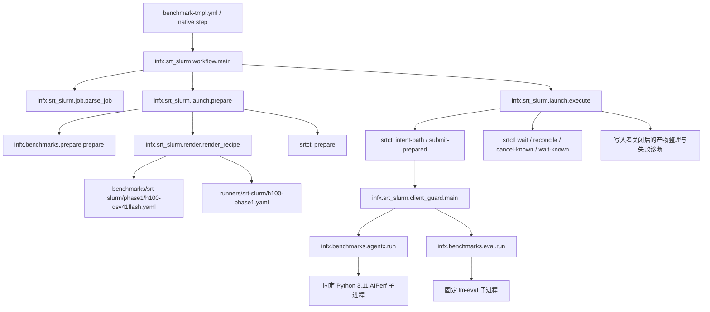

# 阶段 1：预备式 H100 聚合执行

[English](./srt-slurm-phase1.md) | **中文**

阶段 1 实现首条原生 srt-slurm 路径。硬件验收、reader 部署与发布仍待完成；本地测试通过不代表阶段结束。下文重述已批准迁移计划中阶段 1 的验收要求。完整计划及研究资料仍保留在独立的规划 worktree。

## 范围与职责

只有 `dsv41flash-fp4-h100-vllm-agentic-dspark` 使用新的 `execution` 引用。一台独占 H100 节点运行一个直连 vLLM TP8 worker。吞吐并发为 c1、2、4、8、16、20、24、28；另有 c28 GSM8K 真实验证任务。`--all-evals` 对该版本 1 原生契约也仅选择 c28。保留现有镜像、1,048,576 上下文、4096 batched tokens、五 token DSpark、480 分钟分配以及 golden AL 资源。功耗遥测是明确的临时一致性例外；拒绝 `require-power`。

共享 `utils/srt-slurm` gitlink 不变。试点通过独立 `runtime-lock.json` 固定原生源代码与依赖锁。NVIDIA、AMD 参考仓库保持干净。原生 srt-slurm 的 Bash 模板、包装器及安装脚本仍属于允许保留的依赖代码。本阶段不迁移 AMD、MoRI 或 ATOM。


## 调用与文件关系



`ExecutionReference` 绑定配方、profile、runtime lock、client policy 以及 policy 指向的 golden YAML 字节。输入发生变化、YAML 重复键、超出范围或缺少明确排队节点需求，均在分配前失败。`priority` 与 `queue-token` 仅属于调度信息，不改变请求测量点。

准备阶段记录实际安装的原生运行时、wrapper、客户端文件，解释器身份、插件解析、资源路径与内容绑定、不可变模型/数据集 revision、镜像字节。已安装 wrapper 必须与所选 checkout 一致，且不可为 editable。`requested_point_id` 标识请求行；`point_id` 进一步绑定解析后的实际身份；`bundle_digest` 绑定完整可执行快照；`execution_id` 标识一次仓库/run/attempt/请求点 intent。现有 `recipe_fingerprint` 继续用于兼容矩阵 family；原生发布必须验证更强的回执身份。

## 首次 GPU 运行前的部署

在 H100 登录节点与计算容器均可访问的共享 Linux 存储上部署，不复用 macOS 测试环境。原生、wrapper 及所选客户端的 Python 解释器、标准库、已安装依赖、原生源代码、prepared bundle 与客户端缓存均需明确的同路径挂载。挂载根目录必须是规范路径，不接受符号链接别名。原生及 wrapper 使用 Python 3.12，固定的 AgentX 子进程使用 Python 3.11。输出与可写缓存不得放在 `/workspace` 下。HF 模型 snapshot 必须仍能访问相邻 blob 目录；原生模型参数会保留完整缓存路径。

1. 使用原生源代码提交中的 `uv.lock` 安装非 editable 环境：`uv sync --frozen --no-editable --no-dev --python 3.12`。保持该源码 checkout 干净。保留带哈希的 Linux wheel 及构建工具约束：`uv.lock` 固定运行依赖，但未固定上游 Hatch 构建依赖。重新构建时，获取并核实 NVIDIA 的 `v2.2.1` tag 指向 `984180e5b8755aef85e9995048b5a16cb5336bce`，保留相同 hatch-vcs 版本谱系。
2. 从实际测量 checkout 构建并安装非 editable InferenceX wheel，使用共享 Python 3.12 环境。分配前逐文件比较已安装包与 checkout。
3. 准备独立客户端环境并保留实际解析的包产物与锁。AgentX 必须来自 `754356e9a39acc6cc6afb242d123bb57c3fb6f75`；lm-eval 必须来自 `b315ef3b05176acc9732bb7fdec116abe1ecc476`。拒绝 editable 或错误来源。准备阶段记录所有已安装 distribution，而非仅入口包。
4. 完整准备模型/tokenizer snapshot、准确的 `semianalysisai/cc-traces-weka-062126` snapshot 与 GSM8K 缓存。记录真实 revision，不编造或替换。准备原样服务镜像的已校验 squash 文件，记录来源和哈希。客户端离线模型的 `refs/main` 与 snapshot 文件必须纳入资源绑定，解析后的模型 snapshot 必须与服务端的规范路径完全一致，保留 tokenizer 的模型名称同时禁止解析到其他缓存版本。
5. 分别编写 AgentX、eval 的 `ClientSite` JSON：解释器、distribution、离线缓存环境、移除变量、资源根目录/文件、模型 snapshot、超时与终止宽限。`RuntimeSpec` 拒绝凭证；执行时移除继承凭证及未验收的 AIPerf 覆盖项。wheel 包含 eval task 与 1,319 个独立文档哈希。
6. 编写 `PilotSite` JSON，包含两个客户端配置路径、源码/解释器/模型/镜像路径、挂载以及实际部署的 reader/collector revision。准确 schema 见 [`render.py`](../infx/srt_slurm/render.py) 与 [`prepare.py`](../infx/benchmarks/prepare.py)。

准备阶段校验已有资源，不在计算节点安装包、下载模型或修复不完整 snapshot。派生 mmap 缓存使用独立所属 namespace、文件完整性回执、独立校验副本及损坏隔离；锁竞争时的冷准备有明确界限。

先部署 app reader 与 `016_measurement_snapshots.sql` migration，再合入/部署受信任 collector。InferenceX 需配置 `INFX_H100_PHASE1_SITE_JSON`、`INFX_PHASE1_READER_REVISION`、`INFX_PHASE1_COLLECTOR_REVISION`。两个仓库均需配置 `INFX_RECEIPT_ISSUER_SHAS`、`INFX_RECEIPT_ISSUER_WORKFLOW`，workflow 路径为 `.github/workflows/phase1-receipt.yml`。检查时这些变量尚不存在。分支中有代码不等于 reader 已部署。

GitHub 原生启动步骤使用 uv 管理的 Python 3.12，不依赖环境中已有的 `python` 命令。workflow 在准备或申请 Slurm 资源前校验这三个站点/部署变量。错误会列出缺失变量，指出站点 JSON 的无效字段而不回显字段值，并列出与站点配置不一致的 reader/collector revision 变量。该校验要求显式配置，不会准备资源或部署服务。

## 准备、执行与恢复

独立适配器接收明确的文件参数：

```text
python -m infx.srt_slurm.launch --job job.json --site site.json --root CHECKOUT --source source.json --prepare-only
python -m infx.srt_slurm.launch --job job.json --site site.json --root CHECKOUT --source source.json
```

`job.json` 包含生成的矩阵行及明确的 `priority`、`queue-token`、`node-count: 1`。`source.json` 包含 `repository`、数值 `run_id`、数值 `attempt`、完整测量 `head_sha`。不得编造 GitHub run 身份。`--prepare-only` 不申请资源。运行对应测量点前，独立检查并保留准备期预期；worker 后来的 `execution.json` 只用于对照，不能成为预期身份的权威来源。

原生准备必须解析为 `{nodes:1,gpus_per_node:8,serving_gpus:8,workers:1,cardinality:1}`。吞吐从已提交 golden 曲线渲染 synthetic rejection，关闭 adaptive verification；eval 使用真实 block rejection，开启 adaptive verification。直连端口 8000 采用明确的独占节点策略：端口冲突即失败，不能连接其他服务器。

Slurm 分配、claim、已接受 ID、调度器观察与取消均由原生运行时负责。适配器在可中断 submit 前取得日志路径，不重试不明确的提交，也不按 runner 名批量取消。活跃 controller 状态优先于陈旧 accounting；失败但仍活跃的 requeue 不算关闭。取消所有已确认属于该 intent 的资源，并在有界等待内观察终止；未解决的 intent 保持 fenced，等待检查。

成功发布要求原生终止成功及客户端写入者关闭：无错误、超时、信号或孤儿 writer。失败诊断保留原始输出、client audit、冻结输入及原生日志，但不生成已接受 execution manifest。该路径跳过旧 runner 的宽泛前后清理。H100 旧 launcher/script 保留至硬件验收及退休差异审阅完成，以便回退。

## 测量回执与发布

完整源契约为八个吞吐点加一个真实 c28 eval。GSM8K 必须包含全部 1,319 文档及两种 filter（2,638 个评分行），保留 16,384 上下文 / 12,288 生成预算，验证有限分数和完整样本身份。聚合 eval 元数据为 `disagg:false`、`is_multinode:false`、八个服务 GPU、prefill/decode worker 数均为零。

1. 按 [`phase1_publication.py`](../infx/workflows/phase1_publication.py) 的 `Approval` schema 创建经审阅的 `qualification/phase1/*.json`。点、执行、bundle、原生 manifest 身份必须来自独立准备期控制记录，不得从 worker archive 推导。要求完整九点集合及实际数据集 revision。
2. 在 `main` 运行 `phase1-receipt.yml`，`kind: measurement`。受信任代码解析准确 artifact ID，校验 API 所属关系/run/attempt、ZIP 摘要、安全成员，再验证执行身份、规范化指标/config/拓扑/数据集及原始 eval 覆盖，最后封存 `receipt.json`。
3. Staging 根据部署的 issuer allowlist 解析回执。缺少原生回执时关闭导入。App 在写数据库或重置 staging 前校验完整快照；部分导入仅能续传同一不可变回执。
4. 审阅通过的合并/发布 run 结束后，批准 `PublicationRecord` JSON，连接原始回执 artifact/digest、merge SHA/run、changelog artifact/digest 与部署的 app/ingest revision。以 `kind: publication` 运行同一 issuer，不重写原始源回执。
5. 使用支持的 staging/recovery dispatch。自动 main ingest 在源回执或发布记录尚未封存时延后，不回退到旧原生导入路径。恢复传递准确回执与发布引用；app 校验 exact-run/latest 曲线、trace detail、聚合拓扑及 strict-filter eval 可见性。

Merge helper 保留最近明确授权的 `/use RUN_ID` 或 `/reuse-sweep-run RUN_ID`。较新的诊断 run 不会静默替换它；授权证据失效必须重新明确决定。

## 验收账本

| Gate | 状态 / 所需证据 |
| --- | --- |
| 原生及客户端行为 | CPU 测试、已安装 wheel 检查；不声称 GPU 验收 |
| 回执、app、恢复 | 本地单元/数据库/浏览器 smoke 检查；待部署 |
| H100 吞吐 | 原镜像 c1、2、4、8、16、20、24、28 待运行 |
| 真实 eval | 新 c28 待运行；历史完整原始 eval 通过新 validator |
| 取消与清理 | 本地所属关系/race/closure 测试；实际 Slurm 信号验收待做 |
| 测量等价性 | 对照保留基线比较指标、失败、warmup/drain、服务设置及原始 schema |
| 发布 | 受信任回执、后续发布记录及刷新后 app 证据待完成 |
| 功耗 | 明确临时一致性例外；不声称实测功耗 |
| 退休 | 保留旧 H100 script，等待全部出口证据 |

证据就绪后记录实际 InferenceX/native/collector/app 提交、source run/attempt、准备期预期、九点 artifact 绑定、源回执、发布记录与 app 验证报告。不得用编造 ID 或占位成功条目关闭 gate。
