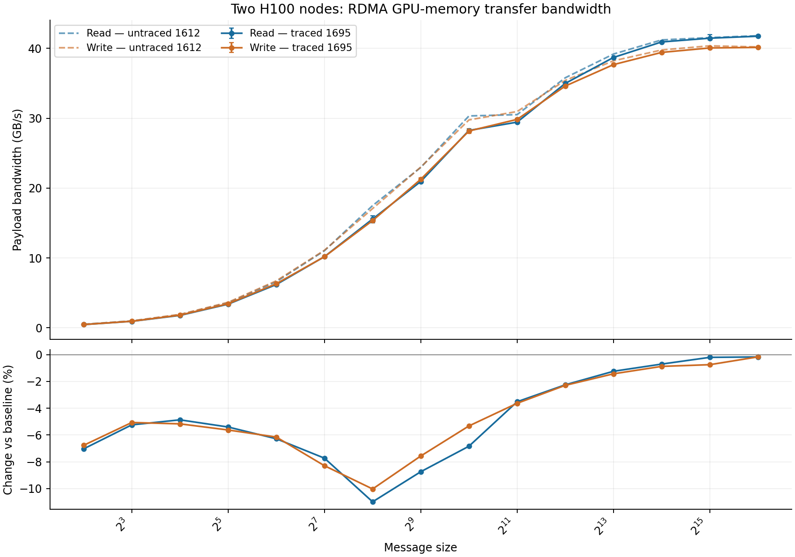
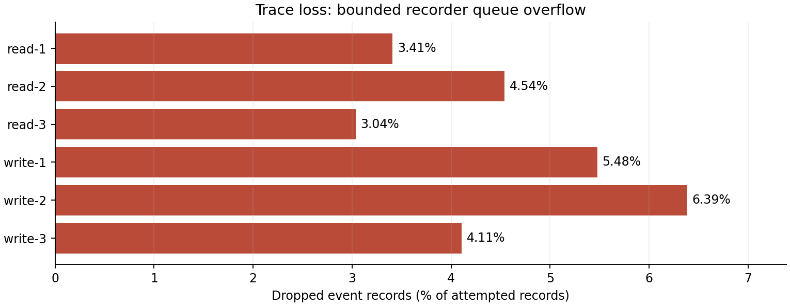

# Mooncake 双节点 H100 传输跟踪实验

[English](README.md) | **中文**

本目录保存了 Mooncake 传输引擎插桩、Slurm 基准启动脚本，以及 2026 年 9 月 24 日的双节点 H100
测试结果。这是独立的 Mooncake 实验，不是 InferenceX 官方推理服务基准，也没有注册新的
InferenceX runner 或 recipe。

## 测试结果

作业 **1695** 用时 **9 分 32 秒**，完成了全部 **90 个测试项**（15 种消息大小 × 读写 × 3 次重复）。
**64 MiB** 消息的平均有效载荷带宽为：**读 41.751 GB/s，写 40.152 GB/s**。
跟踪数据**不完整**：记录队列丢弃了 **2,483,420 条事件（4.50%）**。
不能将这些文件用于无损回放，也不能据此精确重建未完成请求数量的时间线。



| 消息大小 | 读 GB/s | 写 GB/s | 读相对未跟踪基线 | 写相对未跟踪基线 |
| --- | ---: | ---: | ---: | ---: |
| 4 KiB | 0.465 | 0.468 | -7.04% | -6.77% |
| 8 KiB | 0.930 | 0.940 | -5.24% | -5.07% |
| 16 KiB | 1.778 | 1.826 | -4.87% | -5.17% |
| 32 KiB | 3.387 | 3.451 | -5.40% | -5.63% |
| 64 KiB | 6.195 | 6.315 | -6.28% | -6.15% |
| 128 KiB | 10.190 | 10.183 | -7.73% | -8.29% |
| 256 KiB | 15.579 | 15.362 | -10.99% | -10.03% |
| 512 KiB | 20.957 | 21.272 | -8.74% | -7.57% |
| 1 MiB | 28.261 | 28.181 | -6.84% | -5.32% |
| 2 MiB | 29.451 | 29.845 | -3.52% | -3.63% |
| 4 MiB | 34.996 | 34.617 | -2.25% | -2.29% |
| 8 MiB | 38.708 | 37.683 | -1.24% | -1.43% |
| 16 MiB | 40.931 | 39.432 | -0.70% | -0.88% |
| 32 MiB | 41.468 | 40.072 | -0.20% | -0.75% |
| 64 MiB | 41.751 | 40.152 | -0.17% | -0.17% |

表中数据为三次重复的算术平均值；图中的误差线表示最小值和最大值，不是置信区间。
基线为未启用跟踪的作业 **1612**，消息大小和并发设置相同。两次运行的时间和二进制文件不同，
因此这只是观测对比，不能单独归因于跟踪开销。小消息带宽下降约 **4–11%**，64 MiB 时下降约 **0.17%**。
4 KiB 的平均墙钟耗时为**读 8.81 µs、写 8.76 µs**，此前为 **8.19 / 8.17 µs**。

工作负载使用已注册的 **GPU 显存**，每个节点一张 H100 80 GB，**单线程**、**batch size 1**，
缓冲区为 256 MiB。每个测试项预热 1 秒、测量 5 秒。事件跟踪包含这两个阶段。

- 发起端：`slurm-h100-206-025`（`10.0.1.136`）。
- 目标端：`slurm-h100-206-035`（`10.0.3.49:15309`）。
- 读操作的数据方向为 **035 → 025**；写操作为 **025 → 035**。
- 后端为 TENT，传输为单边 RDMA，使用 p2p 元数据发现。
- GB/s 表示十进制有效载荷字节率，KiB 和 MiB 表示二进制消息大小。

大消息摊薄了逐请求开销，带宽接近 **40 GB/s**；当前并发设置下，独立 64 KiB 请求仅达到
**6.2–6.3 GB/s**。这些是传输层结果，不包括 KV 查询、放置、打包、会话亲和性，以及 prefill/decode
计算，不能据此判断多网卡聚合带宽、同时双向吞吐量或实际 PD 推理服务性能。

## 跟踪完整性与限制



对六个发起端文件进行完整扫描后得到：

| 指标 | 数量 |
| --- | ---: |
| 保留的事件记录 | 52,712,290 |
| 丢弃的事件记录 | 2,483,420 |
| 提交与完成均匹配的请求 | 26,355,861 |
| 仅保留提交事件的请求 ID | 285 |
| 仅保留完成事件的请求 ID | 283 |
| 完全缺失的请求 ID | 1,241,426 |
| 尝试执行的逻辑请求，含预热 | 27,597,855 |

所有保留下来的完成事件都报告 RDMA 成功，未发现重复事件。每个发起端文件的尾部计数均与实际
记录数相符。日志中的 `write_failed=0` 表明记录丢失来自有界队列，而不是报告的文件写入失败；
这不能证明缺失事件对应请求的状态。被动目标端只有开始记录，启动脚本在正常清理时终止其等待进程。

记录器在请求合并后仍保留原始描述符，重试不会重复记录逻辑完成，并单独标记内部 staging 请求。
默认关闭记录；即使聚合指标在编译时关闭也可工作。通过 `TENT_TRACE_DIR` 启用，Slurm 启动脚本
提供 `TRACE=1` 开关。

时间戳表示请求接纳及**观察到的**完成时间，包含轮询延迟；它们不是网卡硬件时间戳、网络包、CPU
指令或目标端 receive 调用。请求 ID 仅在单个跟踪文件内有效，不是应用请求或会话 ID。丢失不一定
随机，因此保留记录的延迟和速率分布可能有偏。精确回放需要零丢失记录，以及驱动层 ID 和阶段标记。
增大缓冲区可以吸收突发，但不能解决持续的写出吞吐不足。

## 包内容

| 路径 | 内容 |
| --- | --- |
| [patches/0001-tent-transfer-event-recorder.patch](patches/0001-tent-transfer-event-recorder.patch) | 记录器实现、引擎与对端名称查询集成、九个测试、CMake 注册和数据格式说明 |
| [patches/0002-tebench-slurm.patch](patches/0002-tebench-slurm.patch) | 双节点 H100 启动脚本、可选跟踪、计算节点 Pyxis 构建及使用说明 |
| [patches/0003-store-benchmark-slurm.patch](patches/0003-store-benchmark-slurm.patch) | 此前的 Store KV、微基准和本地存储 Slurm 适配；本报告的 RDMA 数据并非由这些脚本生成 |
| [patches/series](patches/series) | 补丁应用顺序 |
| [results/tebench-1695.6UKR6R](results/tebench-1695.6UKR6R) | 跟踪运行的汇总、日志、拓扑、图表、完整性分析，以及 90 个窗口中的 1,440 个采样请求区间 |
| [results/tebench-1612.XD95we](results/tebench-1612.XD95we) | 未跟踪基线的汇总和拓扑 |
| [scripts/analyze_traces.py](scripts/analyze_traces.py) | 流式完整文件审计，显式指定结果目录、跟踪目录和进程数 |
| [scripts/extract_trace_windows.py](scripts/extract_trace_windows.py) | 在每个阶段中点附近提取 16 个匹配请求区间，适用于本实验的顺序单线程记录 |
| [validation/ctest.log](validation/ctest.log) | 原始 64 项测试的输出 |
| [manifest.json](manifest.json) | 基础版本、补丁结果文件哈希、来源及外部原始文件清单 |
| [SHA256SUMS](SHA256SUMS) | 包内文件校验和，不包含校验和文件自身 |
| [LICENSE-Mooncake](LICENSE-Mooncake) | 上游 Apache-2.0 许可证 |

**16.39 GiB 原始事件文件**、构建后的二进制文件及容器镜像不包含在本目录中。原集群上的原始跟踪仍位于：

```text
/mnt/home/kimbo/networkx/Mooncake/benchmark-results/tebench-1695.6UKR6R/events
```

无需此目录即可阅读本包的结果；重新执行完整审计则需要这些外部文件。历史命令和日志中的路径用于
保留来源，不是可移植的默认配置。对话中的交互式视图未打包，其采样数据保存在 `trace-windows.json`。

## 应用补丁与复现

补丁基于 Mooncake 提交 **`fe0d23e332f41c7d54b5c217194dce5f8e751b21`**，包含此前尚未提交的修改。
请使用新的 checkout，不要在已修改的原工作目录重复应用。先替换下方两个路径：

```bash
export PACKAGE=/path/to/InferenceX/experimental/mooncake-transfer-traces
export MOONCAKE_ROOT=/path/to/Mooncake-repro
git clone https://github.com/kvcache-ai/Mooncake.git "$MOONCAKE_ROOT"
git -C "$MOONCAKE_ROOT" checkout --detach fe0d23e332f41c7d54b5c217194dce5f8e751b21
git -C "$MOONCAKE_ROOT" apply --check "$PACKAGE"/patches/*.patch
git -C "$MOONCAKE_ROOT" apply "$PACKAGE"/patches/*.patch
```

归档的 Slurm 脚本在 Mooncake 内运行，并保留其原有配置约定；它们不是新的 InferenceX runner
入口。传输实验只需要补丁 1 和 2，补丁 3 可选。应用后，完整记录器说明位于该 checkout 的
`mooncake-transfer-engine/tent/TRANSFER_EVENTS.md`。

在原集群上，可使用以下命令复现完整跟踪扫描：

```bash
export BUILD=1 TRACE=1 BUILD_ONLY=0
export MIN_BYTES=4096 MAX_BYTES=67108864 BUFFER_BYTES=268435456
export BATCH_SIZE=1 THREADS=1 DURATION=5 REPEATS=3
export SEG_TYPE=VRAM OPS="read write" TENT_TRACE_BUFFER_RECORDS=65536
sbatch --partition=h100 --account=cw-sup --nodes=2 \
  --nodelist=slurm-h100-206-025,slurm-h100-206-035 --gpus-per-node=1 \
  "$MOONCAKE_ROOT/mooncake-transfer-engine/benchmark/slurm/tebench.sbatch"
```

启动脚本在计算节点的轻量可写 `ubuntu:22.04` Pyxis 容器中构建，使用宿主机
`/usr/local/cuda-13.0` 下的 CUDA，因此登录节点不需要 CMake。构建依赖安装在容器内，镜像缓存为
`build/tebench-pyxis/runtime.sqsh`，两个节点都使用该镜像运行。前提是具备所列 Slurm 分区、账号和
节点，以及 Pyxis/Enroot、共享可写存储、CUDA、RDMA 设备和软件包下载权限。在其他集群上需调整
路径和资源。镜像标签及 apt 软件包没有固定到摘要或版本，因此无法保证逐位相同的重建结果。
只有成功构建了包含记录器的程序后，才可使用 `BUILD=0`。

结果位于 `$MOONCAKE_ROOT/benchmark-results/tebench-JOBID.XXXXXX/`，跟踪位于其 `events/` 子目录。
外层日志默认为提交目录下的 `tebench-JOBID.out`，可用 `--output` 覆盖。上面的队列大小复现了本次
溢出设置，**不保证**跟踪完整。要控制跟踪开销对比，应在同一二进制和相同设置下连续运行 `TRACE=0`
与 `TRACE=1`；只有全部发起端尾部计数均为零丢失时，才能讨论无损回放。

## 重新分析与验证

流式审计需要 Python 3.10+ 和 `orjson`；完整数据集建议在计算节点处理。若原始文件已迁移，请修改
`EVENTS_DIR`。以下命令会替换 `RUN_DIR` 中派生的 JSON 文件；如需保持包内结果不变，请先复制运行目录。

```bash
export RUN_DIR="$PACKAGE/results/tebench-1695.6UKR6R"
export EVENTS_DIR=/mnt/home/kimbo/networkx/Mooncake/benchmark-results/tebench-1695.6UKR6R/events
python3 -m pip install -r "$PACKAGE/scripts/requirements.txt"
python3 "$PACKAGE/scripts/analyze_traces.py" \
  --run-dir "$RUN_DIR" --events-dir "$EVENTS_DIR" --workers 3
python3 "$PACKAGE/scripts/extract_trace_windows.py" \
  --run-dir "$RUN_DIR" --events-dir "$EVENTS_DIR"
```

完整审计按文件内请求 ID 配对并核对尾部计数。窗口提取器利用单调的事件顺序定位，不适用于任意
交错的多线程跟踪。这些脚本不会重新生成 Markdown 或图表。

已保存的运行证据：

- 作业 **1694**：**64 项测试通过**，包括 9 项记录器、8 项合并、30 项故障切换、14 项队列派发、3 项因果链测试；编译时关闭聚合指标。
- 作业 **1693**：双节点 H100 冒烟测试，**16,442 对匹配事件**，零丢失。
- 作业 **1695**：完整扫描的 90 项全部完成，**事件丢失率 4.50%**。
- 作业 **1696**：完成六个发起端跟踪文件的全量扫描。

打包验证会将全部补丁应用到指定基础版本的文件上，比较所得文件哈希与已测试工作目录是否一致，
并在受控跟踪样本上运行包内分析工具。本次打包不声称再次运行了 GPU 性能测试。
