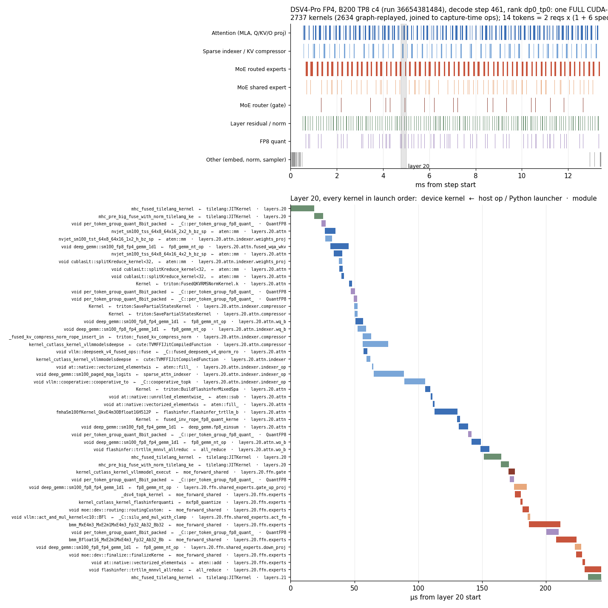
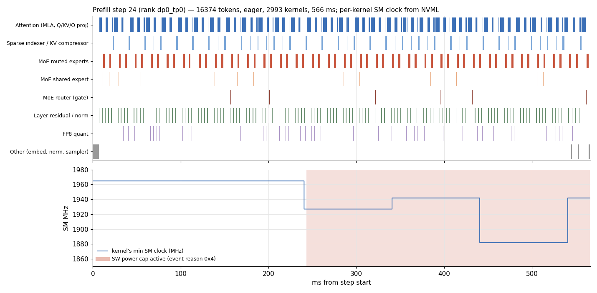

# Op-attributed vLLM profiles for AgentX points

Profiles a single-node vLLM srt-slurm AgentX point (for example
`dsv4-fp4-b200-vllm-agentic-mtp`) during its real replay and attributes every
device kernel to the CPU-side call stack that launched it: the module stack,
the torch op, and for kernels launched straight from Python, the launcher and
its vLLM callers. Kernels replayed from CUDA graphs are attributed through the
graph's capture.

## Running

Dispatch `e2e-tests.yml` on a branch carrying this directory with a `profile`
input (a JSON object; `{}` takes every default):

```sh
gh workflow run e2e-tests.yml -R SemiAnalysisAI/InferenceX --ref <branch> --json <<'EOF'
{
  "ref": "<branch>",
  "agentx-fast": "true",
  "test-name": "profile test",
  "profile": "{}",
  "generate-cli-command": "test-config --config-files configs/nvidia-master.yaml --scenario-type agentic-coding --no-evals --conc 32 --config-keys dsv4-fp4-b200-vllm-agentic-mtp"
}
EOF
```

One concurrency selects one recipe variant (for DSV4 on B200: `tp8_c*` or
`dep8_c*`). Settings (`infx/srt_slurm/single_node.py`, `PROFILE_DEFAULTS`):

| Setting | Default | Meaning |
|---|---|---|
| `windows` | `[["warmup", 0, 32], ["decode", 0, 32]]` | `[anchor, delay_seconds, iterations]` per torch profiler window. `warmup` and `profiling` anchor on aiperf logging that phase's start; AgentX warmup is the lanes' long first turns, all sent at its start (prefill-heavy; at TP8 c4 they have drained by 60 s in). `decode` anchors on steady decode: from the warmup start, the first 20 s in which at least 90% of the engines' logged steps replayed FULL CUDA graphs (falling back to 150 s before the measured replay's cap). Each measured-phase turn re-prefills first, so under data parallelism, where one prefilling rank keeps every rank eager, steady decode arrives late and at a time that depends on concurrency |
| `capture_ranks` | `"dp0_tp0"` | Workers whose CUDA graph capture is profiled (`"all"` for every rank) |
| `host_headroom_gib` | `128` | Host memory taken from a CPU KV tier for the profiler's buffers: a SimpleCPUOffload pool, or an embedded Mooncake store's per-rank `global_segment_size` |
| `duration` | last `profiling` delay + 600 s | Cap on the measured replay. Once its last window closes (and the measured phase has run 60 s), the window client SIGINTs aiperf, which exports what it measured and exits zero, so the run does not replay past its windows |
| `mode` | `"agentic"` | `"agentic"` replays AgentX; `"synthetic"` drives fixed shapes (`synthetic_load.py`): CONC random-token prompts of `isl` tokens with one-token outputs while the prefill window is open, then `osl`-token generations until the decode window closes. No trace dataset or AgentX warmup: a point takes minutes after engine start-up |
| `isl`, `osl` | `8192`, `4096` | Synthetic prompt and output lengths. `isl` stands in for the KV context: decode steps attend over `isl` plus the tokens generated so far |

A profiled point holds its node for 30 to 60 minutes on B200 (engine start-up
and graph capture, then an AgentX warmup that grows with concurrency). Its
throughput is not a result: windows pause the engine while they export, and
profiled runs tolerate failed requests.

At DSV4 DEP8 c192 on B200, a warmup window has preceded an engine fault in two
of three runs (`CUBLAS_STATUS_EXECUTION_FAILED` in the attention compressor's
`torch.mm`, when warmup's cache-pressure requests arrive, minutes after the
window closed); the same point without it (`{"windows": [["decode", 0, 32]]}`)
and unprofiled production runs complete. Profile such a point's prefill
(`{"windows": [["warmup", 0, 32]]}`) and decode in separate runs.

Deviations from the recipe, all recorded in the run's config: vLLM's torch
profiler config, the patch's environment, a raised `VLLM_RPC_TIMEOUT`, and on
CPU-offload recipes an offload pool smaller by `host_headroom_gib`.

## Example

DSV4-Pro FP4 on B200, TP8 c4. A decode step: one FULL CUDA-graph replay,
every kernel joined to the op, launcher and module that launched it:



A prefill step with each kernel's SM clock; the SW power cap engages and the
clock steps on NVML's ~100 ms grid:



## Artifacts

- `profile_<result>`: `infx-profile.tar`, the full record.
  - `torch/`: vLLM's per-rank traces, one per window.
  - `capture/`: the CUDA graph capture trace (full Python stacks).
  - `steps/<rank>.jsonl`: every step's batch composition on that rank.
  - `copies/<rank>.jsonl`: every CPU KV-offload block copy the rank queued
    (direction, blocks, bytes, step, vLLM callers).
  - `routing/<rank>/step<k>.npz`, `routing/<rank>/meta.json`: each profiled
    step's MoE routing: `counts` (tokens per expert per layer, int32
    `[layers, experts]`), `tokens`, `t0_ns`, and `ids` (each token's top-k
    expert ids per layer, int16 `[tokens, layers, topk]`, -1 for none) when
    the step has at most 1024 tokens. `meta.json` maps layer ids to module
    names and lists layers the capture could not bind.
  - `clocks/window<w>.csv`, `clocks/gpus.json`: every GPU's graphics, SM,
    memory and video clocks and clock event reasons, polled through NVML every
    250 us per GPU for the length of each window, each poll stamped when it
    began and returned (`clock_sampler.py`).
  - `graphs/`, `env/`, `windows_conc<c>.jsonl`: graph ordinals, versions and
    config per rank, and the window log.
- `profile_steps_<result>`: the same profile broken down by step
  (`extract.py`).
  - `index.json`: every step file with its kernel count, device span,
    tokens, request count and cudagraph mode.
  - `report.json`: per-trace attribution coverage, graph joins, and the
    kernel-name check.
  - `window<w>/<rank>/step<k>.json.gz` (`dummy<k>` for an idle DP rank's
    forward, `unstepped` for kernels outside any step):

    ```
    {"rank", "window", "kind", "step",
     "summary": {"kernels", "busy_us", "t0_us", "t1_us", "span_us", "sources"},
     "batch":   {"total_tokens", "reqs": [{"req", "scheduled", "computed", "spec",
                                           "new", "prompt_len"}], "dispatch": [...]},
     "routing": {"source_rank", "tokens", "topk", "num_experts", "has_ids", "file",
                 "expert_tokens": {"<MoE module>": [[expert, tokens], ...]}},
     "kernels": [{"kernel", "cat", "stream", "device", "ts_us", "dur_us",
                  "source": "eager" | "graph" | "offload_copy" | "unattributed",
                  "module_stack": [[qualified name, [[shape, dtype], ...]], ...],
                  "op", "op_chain", "input_dims", "input_types", "concrete_inputs",
                  "launcher", "launcher_callers", "annotations",
                  "graph", "node_pos", "graph_node_id", "grid", "block",
                  "copy": {"store", "blocks", "bytes", "issue_lag_us"},
                  "clocks": {"graphics_mhz": [min, max], "sm_mhz": [min, max],
                             "mem_mhz": [min, max], "video_mhz": [min, max],
                             "event_reasons", "samples", "prior_us"}, ...}]}
    ```

## How attribution works

`sitecustomize.py` loads through `PYTHONPATH` and does nothing unless
`INFX_PROF_DIR` is set. Its markers are `record_function` ranges emitted only
while a profiler runs:

- `infx_step#k` / `infx_dummy#k`: a scheduled step and an idle DP rank's
  dummy forward. Each step's batch composition is logged under the same `k`.
- `infx_mod#<qualified name>#<dims>:<dtype>;...` (e.g. `7x7168:bfloat16`): every
  module call and its tensor inputs, through
  global module hooks registered only while a window is open, and only when
  the engine is not torch.compiled.
- `infx_py#<launcher>#<vLLM frame>|...`: the Python entry points that launch
  kernels without a torch op (Triton, TileLang, CuTe DSL, vLLM's DeepGEMM and
  FlashInfer wrappers).
- `infx_graph_capture#n` / `infx_graph_replay#n`: CUDA graph ordinals.

Marker names carry no quotes or backslashes: Kineto writes event names into the
trace JSON unescaped, and the extractor fails on a trace it cannot decode.

An eager kernel joins its launch through the CUDA correlation id. A kernel
replayed from graph `n` carries a `graph node id`: ordered by node id, graph
`n`'s nodes pair with the launches recorded while graph `n` was captured,
which carry that launch's full context. `report.json` counts a graph whose
node count differs from its captured launches as `count_mismatch`, and lists
graph kernels whose op never launched that kernel eagerly.

CPU KV offload (SimpleCPUOffloadConnector) copies blocks with
`cuMemcpyBatchAsync` from the connector's copy thread. Kineto records neither
that driver call nor `record_function` ranges on that thread, so those memcpys
have no CPU launch. Each queued copy is one memcpy on its direction's stream,
run in queue order, and `copies/` logs each one as it is queued. Per direction,
the extractor pairs the memcpys in order with the logged copies issued before
them (with equal bytes), taking the pairing with the least total issue lag.
The step markers put the log's wall clock on the trace clock.

On AMD the sampler reads `amdsmi`'s gpu_metrics instead of NVML: the graphics
clock fills both `graphics_mhz` and `sm_mhz`, and `event_reasons` holds the
gpu_metrics throttle status (AMD's bit meanings, not NVML's). `gpus.json`
records which metrics fields were read; ranks join to GPUs by UUID or PCI
address.

A kernel's `clocks` are its GPU's polls over its lifetime: the last poll that
returned before it started (`prior_us` earlier) and every poll overlapping it
(`samples`), as each clock's min and max and the OR of the event-reason
bitmasks (NVML `nvmlClocksEventReason*`). The window client, not the engine,
polls NVML, one thread per GPU, from just before each window opens until every
engine that started profiling has stopped (`profiler/<rank>.jsonl`, logged by
the patch) plus twice the window's longest step, as the GPU trails the engine;
the env record's GPU UUID ties a rank to its polls. On B200 an NVML poll occasionally blocks for 10 to 55 ms, more often
under prefill load; a reading is from somewhere inside its poll, and a kernel
within such a poll shows it as a large `prior_us`.
`report.json` gives each trace's clock coverage and `prior_us` percentiles.

MoE routing is dynamic, so each step records what its router chose. vLLM's MoE
layers and routers call a `capture_fn` with their top-k expert ids (the
routed-experts capture hook); the patch binds its own capturer there, on every
MoE layer of the target model (not the draft), before CUDA graph capture. It
copies the ids into a device buffer, a GPU copy that graphs capture and replay.
Inside a window, every step's rows are copied to pinned host memory
asynchronously (`infx_routing_copy`) and written at the window's stop. The ids
are logical expert ids before EPLB remapping, for this DP rank's tokens; TP
ranks route the same tokens, so TP rank 0 writes for its group. A step file's
`routing.expert_tokens` is keyed by the MoE module name, which joins to the
`module_stack` of that layer's MoE kernels. The capture adds one small copy
kernel per MoE layer per step to every profiled run.
