# 流水线架构

<div align="center">

[English](architecture.md) | **中文**

</div>

本页说明声明的基准测试如何转化为经过验证的作业、运行时结果、GitHub Actions 工件，并最终成为 InferenceX-app 使用的一行数据。本页描述各层边界和不变量。字段级行为仍以链接的实现为准。


仓库按 `inferencex-e2e/`、`collectivex/`、`operatorx/`、`shared/` 和 `experimental/` 划分。本文中的路径和 shell 命令均相对 `inferencex-e2e/`；Python 打包元数据和 `.python-version` 位于该项目目录。GitHub 工作流仍位于仓库根目录。


## 页面索引

1. [源码映射](#源码映射)
2. [端到端流程](#端到端流程)
3. [归属边界](#归属边界)
4. [阶段 1：配置与触发选择](#阶段-1配置与触发选择)
5. [阶段 2：验证与矩阵生成](#阶段-2验证与矩阵生成)
6. [阶段 3：工作流分派](#阶段-3工作流分派)
7. [阶段 4：启动器与运行时执行](#阶段-4启动器与运行时执行)
8. [阶段 5：基准测试与评测输出](#阶段-5基准测试与评测输出)
9. [阶段 6：工件收集与交接](#阶段-6工件收集与交接)
10. [阶段 7：InferenceX-app 摄取](#阶段-7inferencex-app-摄取)
11. [权威来源决策](#权威来源决策)
12. [追踪并验证一项结果](#追踪并验证一项结果)
13. [停止条件](#停止条件)

## 源码映射

### InferenceX 生产方

| 权威来源 | 职责 |
| --- | --- |
| [`configs/CONFIGS.md`](../configs/CONFIGS.md) | 面向人员的主配置和运行器配置契约 |
| [`configs/nvidia-master.yaml`](../configs/nvidia-master.yaml)、[`configs/amd-master.yaml`](../configs/amd-master.yaml) | 声明式的模型、镜像、框架、场景、拓扑和搜索空间意图 |
| [`configs/runners.yaml`](../configs/runners.yaml) | 调度标签、具体运行器名称，以及生成过程和启动器读取的各集群记录（`clusters:`） |
| [`perf-changelog.yaml`](../perf-changelog.yaml) | 以仅追加方式选择要针对某项变更运行的配置键 |
| [`infx/matrix/validation.py`](../infx/matrix/validation.py) | 强制执行的 Pydantic 模式和跨字段不变量 |
| [`infx/matrix/generate.py`](../infx/matrix/generate.py) | 搜索空间展开、默认值、过滤器、派生元数据、运行器解析和评测选择 |
| [`infx/matrix/plan.py`](../infx/matrix/plan.py) | 变更日志选择、配置键展开、追加模式比较、矩阵分桶及最终验证；通过 `python -m infx.matrix.plan` 运行 |
| [`.github/workflows/run-sweep.yml`](../../.github/workflows/run-sweep.yml) | PR 触发策略、矩阵扇出和收集依赖 |
| [`.github/workflows/merge-ingest.yml`](../../.github/workflows/merge-ingest.yml) | 合并时复用验证、变更日志元数据和跨仓库摄取分派 |
| [`.github/workflows/benchmark-tmpl.yml`](../../.github/workflows/benchmark-tmpl.yml)、[`.github/workflows/benchmark-multinode-tmpl.yml`](../../.github/workflows/benchmark-multinode-tmpl.yml) | 可复用作业输入契约、环境映射、启动器调用、结果检查和单作业上传 |
| [`infx/launch/`](../infx/launch) | `python -m infx.launch run`：根据运行器名称解析集群、选择启动路径（驱动）、工作负载策略、信号安全的清理以及工件暂存 |
| [`infx/clusters/`](../infx/clusters)、[`infx/launch/backends/`](../infx/launch/backends) | 类型化集群记录（每个调度器一个设置模型），以及运行容器、跟踪作业的调度器后端（目前为使用 Pyxis squash 镜像的 Slurm） |
| [`runners/srt-slurm/`](../runners/srt-slurm) | srt-slurm 主机设置 hook 和临时上游补丁 |
| [`infx/bench/`](../infx/bench) | 在容器内运行的 `python3 -m infx.bench` 命令（`wait`、`fixed-seq`、`agentic`、`eval`），负责服务器就绪检查、基准测试客户端、AgentX 重放和评估 |
| [`benchmarks/`](../benchmarks) | 特定于框架和拓扑的服务器与客户端命令 |
| [`infx/github.py`](../infx/github.py) | 工作流操作共用的 GitHub REST、分页和评论表态基础操作 |
| [`infx/workflows/`](../infx/workflows) | 复用命令解析、授权查找、源 Run 验证及表态反馈；现有复用 CLI 保持兼容 |
| [`infx/results/`](../infx/results) | 可导入的结果构建函数、组件元数据解析和功耗指标转换；通过 `python -m infx.results.fixed_sequence` 处理固定序列结果 |
| [`.github/workflows/collect-results.yml`](../../.github/workflows/collect-results.yml)、[`.github/workflows/collect-evals.yml`](../../.github/workflows/collect-evals.yml) | 运行级基准测试和评测工件聚合 |

### InferenceX-app 使用方

这些是跨仓库链接，因为数据库和展示侧契约由 InferenceX-app 负责。

| 权威来源 | 职责 |
| --- | --- |
| [`.github/workflows/ingest-results.yml`](https://github.com/SemiAnalysisAI/InferenceX-app/blob/main/.github/workflows/ingest-results.yml) | 接收 `ingest-results` 和 `ingest-agentic-results`，准备工件、执行迁移、摄取、验证并使缓存失效。智能体摄取使用更大的运行器和更长的超时时间 |
| [`packages/db/src/prepare-ci-artifacts.ts`](https://github.com/SemiAnalysisAI/InferenceX-app/blob/main/packages/db/src/prepare-ci-artifacts.ts) | 选择并下载源运行工件，包括复用扫描元数据 |
| [`packages/db/src/ingest-ci-run.ts`](https://github.com/SemiAnalysisAI/InferenceX-app/blob/main/packages/db/src/ingest-ci-run.ts) | 编排工作流运行、基准测试、评测、样本、追踪、统计、可用性和变更日志的摄取 |
| [`packages/db/src/etl/benchmark-mapper.ts`](https://github.com/SemiAnalysisAI/InferenceX-app/blob/main/packages/db/src/etl/benchmark-mapper.ts) | 将基准测试工件行映射为面向数据库的规范形态 |
| [`packages/db/src/etl/eval-mapper.ts`](https://github.com/SemiAnalysisAI/InferenceX-app/blob/main/packages/db/src/etl/eval-mapper.ts) | 映射聚合评测工件和按配置划分的评测工件 |
| [`packages/db/src/etl/normalizers.ts`](https://github.com/SemiAnalysisAI/InferenceX-app/blob/main/packages/db/src/etl/normalizers.ts) | 解析规范模型、硬件、框架和精度 |
| [`packages/db/src/etl/skip-tracker.ts`](https://github.com/SemiAnalysisAI/InferenceX-app/blob/main/packages/db/src/etl/skip-tracker.ts) | 记录未映射或被拒绝的输入，避免静默丢失 |
| [`packages/app/src/app/api/v1/invalidate/route.ts`](https://github.com/SemiAnalysisAI/InferenceX-app/blob/main/packages/app/src/app/api/v1/invalidate/route.ts) | 在摄取通过验证后使应用缓存失效 |
| [`packages/app/src/app/api/v1/benchmarks/route.ts`](https://github.com/SemiAnalysisAI/InferenceX-app/blob/main/packages/app/src/app/api/v1/benchmarks/route.ts) | 向仪表板提供持久化的基准测试行 |
| [InferenceX-app 架构](https://github.com/SemiAnalysisAI/InferenceX-app/blob/main/docs/architecture.md)、[数据流水线](https://github.com/SemiAnalysisAI/InferenceX-app/blob/main/docs/data-pipeline.md) | 使用方的设计理由、缓存策略、ETL 和前端转换 |

## 端到端流程

```mermaid
flowchart LR
  A[主 YAML 和 runners.yaml] --> B[Pydantic 验证]
  P[perf-changelog 新增项] --> C[infx.matrix.plan]
  B --> D[infx.matrix.generate]
  C --> D
  D --> E[经过验证的 JSON 矩阵]
  E --> F[run-sweep.yml 扇出]
  F --> G[可复用基准测试工作流]
  G --> H[infx.launch 驱动]
  H --> I[配方或脚本与 infx.bench 命令]
  I --> J[基准测试、评测、日志、指标、追踪]
  J --> K[单作业 GitHub 工件]
  K --> L[运行级聚合工件]
  L --> M[merge-ingest.yml 向 InferenceX-app 分派]
  M --> N[准备并下载工件]
  N --> O[映射、规范化并向上插入数据库行]
  O --> Q[验证数据库并刷新最新基准测试]
  Q --> R[使缓存失效]
  R --> S[仪表板 API 和 UI]
```



关键交接点是具有 JSON 形态的契约。主 YAML 被读取到经过验证的 Python 模型中。生成器发出矩阵 JSON。可复用工作流将每一行矩阵映射为有类型的工作流输入和环境变量。运行时脚本写入 JSON 文件。GitHub 工件名称向下游 TypeScript 摄取过程标识这些文件。

没有任何单个文件负责整条流水线。正确性来自每个交接点上的一致性。

## 归属边界

| 层 | 负责 | 不负责 |
| --- | --- | --- |
| 主配置 | 所需的基准测试标识、镜像、框架、场景、支持的拓扑和搜索空间 | Shell 命令、物理挂载、工件解析或数据库规范化 |
| 验证 | 接受的字段名称、类型以及拓扑或作用域不变量 | 运行哪个变更日志条目、调度优先级或运行时功能支持 |
| 矩阵生成器 | 展开为可执行点、默认值、派生名称和长度、评测标记以及运行器解析 | 容器启动或基准测试实现 |
| 变更日志处理器 | 选择发生变更的配置键，并将其分组到工作流矩阵桶中 | 每项配置的定义或其运行时行为 |
| 扫描工作流 | PR 触发和标签策略、金丝雀与 PR 复用门控策略、矩阵扇出和依赖门控 | 特定于机群的启动细节、摄取分派或数据库映射 |
| 合并摄取工作流 | 合并时复用验证、变更日志元数据上传和唯一一次摄取分派 | 基准测试执行或数据库映射 |
| 可复用工作流 | 稳定的作业输入和环境契约、自托管调度、启动器调用、文件存在性检查和工件上传名称 | 模型路径选择或框架 CLI 标志 |
| 启动器（`infx.launch`） | 依据集群记录的物理运行器行为、模型暂存、挂载、容器、Slurm 分配，以及选择驱动、运行时脚本或外部方案 | 逻辑搜索空间策略或数据库模式 |
| 基准测试和评测代码 | 服务器标志、客户端负载、评分、可供聚合的文件和运行时清理 | 请求了哪些矩阵点或数据行如何在仪表板中显示 |
| 工件收集器 | 运行级打包和稳定的聚合工件名称 | 对基准测试结果进行语义重解释 |
| InferenceX-app ETL | 规范化、幂等持久化、跳过报告、可用性、追踪旁路文件和数据库验证 | 服务引擎如何启动或生产方应调度哪些点 |
| InferenceX-app API 和 UI | 缓存生命周期、查询行为、客户端转换和展示 | 生产方配置和基准测试执行 |

跨越边界的字段不会自动在下一层中成为权威来源。例如，主条目中的 `framework` 是权威的生产方元数据。启动器仍然必须将该值路由到兼容的脚本。随后，InferenceX-app 会将其规范化为数据库中的规范键。这些是不同的职责，而不是同一功能的重复实现。

## 阶段 1：配置与触发选择

主 YAML 文件描述可能执行的工作。配置键将模型、镜像、模型前缀、精度、框架、运行器标签、场景定义以及一个或多个搜索空间条目绑定在一起。[`configs/runners.yaml`](../configs/runners.yaml) 解析调度标签，其中的 `clusters:` 记录提供生成时使用的节点形状，以及启动器使用的 Slurm、镜像、路径和模型信息。

主条目在被选中之前不会生效。在由变更日志驱动的路径上，[`perf-changelog.yaml`](../perf-changelog.yaml) 的新增内容会选择确切的配置键或键模式。[`infx.matrix.plan`](../infx/matrix/plan.py) 仅读取基础引用与头部引用之间新增的变更日志行。它会验证每个新增条目，针对已加载的主配置展开键模式，并为选中的键调用矩阵生成器。

这种拆分有两个结果。

1. 主文件是受支持工作的目录。变更日志是审计记录和触发选择，而不是配置内容的另一个副本。
2. 如果编辑主条目时没有添加匹配的变更日志条目，则不会通过 `run-sweep.yml` 调度该变更，因为其路径触发器监视的是 `perf-changelog.yaml`。

`infx.matrix.plan` 会在发出的 JSON 中保留变更日志元数据。工作流随后将其作为 `changelog-metadata` 上传，使 InferenceX-app 能够将持久化的数据行与所选变更关联起来。

## 阶段 2：验证与矩阵生成

共享 Python 实现位于`inferencex-e2e/` 下的 `infx` 包中。`infx.matrix.generate` 负责矩阵生成，`infx.matrix.validation` 负责模式校验。Python 调用方应通过这些规范路径导入；后续领域模块可在需要时加入 `infx`。

其余 Python 工具按职责划分：

| 包 | 职责 |
| --- | --- |
| `infx.workflows` | 优先级评分、变更日志验证及合并准备、复用验证、恢复和运行统计 |
| `infx.results` | 结果收集、比较、文件命名、功耗、绘图及 AgentX 产物处理 |
| `infx.evals` | 评测适配器、分数验证、任务 YAML、样例数据和运行时补丁 |
| `infx.bench_serving` | 基准测试客户端及其请求、编码和导出辅助函数 |
| `infx.datasets` | AgentX 轨迹采样、转换、数据集构建及分布图 |
| `infx.klaud` | Klaud 编排、生命周期、GitHub/API 适配器和模式 |

从 `inferencex-e2e/`使用 `python -m infx.<package>.<module>` 运行命令。依赖仍由各命令分别管理；导入 `infx` 不会加载基准测试客户端或评测依赖。`utils/` 下的 Python 兼容包装文件已删除。数据集工具、AgentX 聚合与分析、评测适配器与补丁，以及基准测试客户端辅助模块应使用规范的 `infx` 路径。评测文档位于 `infx/evals/EVALS.md`，评测测试位于 `infx/tests/evals/`。其他行为测试位于 `infx/tests/`。`utils/` 下仅保留运行器配置 Shell 脚本（`utils/runner_setup/`）及外部子模块 `aiperf` 和 `srt-slurm`。

复制到隔离环境中的评测适配器和补丁使用 `infx/evals` 下的实际文件，因此仍可独立运行。可信工作流辅助模块会明确选择工具代码所在的检出目录。固定序列处理、评测分数验证和单节点 AgentX 结果验证步骤使用单独检出的工作流修订版中的包，并以被测检出目录为工作目录。仅评测作业也会准备工具代码和 Python 3.12。因此，历史被测修订版无需包含这些辅助模块。分数阈值取自工作流修订版随包提供的 `infx/evals/thresholds.yaml`。

默认仓库路径定义在 [`infx/config.py`](../infx/config.py) 中。配置常量从 `infx.config` 导入，模式从 `infx.matrix.validation` 导入。包的 `__init__.py` 文件保持精简。

从 `inferencex-e2e/` 或安装好的包运行 `python -m infx.matrix.plan` 进行变更日志规划，运行 `python -m infx.workflows.validate_perf_changelog` 进行验证。矩阵生成使用 `python -m infx.matrix.generate` 入口，并指定 `full-sweep` 或 `test-config` 子命令。其他修订版的配置只由该修订版自身的工具解释，绝不由当前代码解析，因此配置格式变化不会破坏读取历史修订版的流程：[`infx.matrix.revision`](../infx/matrix/revision.py) 通过 Git 快照中该修订版自身的生成器处理 append-only 基准修订版和 Klaud 基线产出者，并通过被测检出目录自身的规划器处理摄取恢复和可信变更日志调度。

使用当前工具代码的工作流直接调用 `infx` 模块，测试也导入规范模块。可信调度和结果处理通过 `PYTHONPATH` 和 Python 的 `-P` 选项明确指定工具代码所在的检出目录，同时仍以目标检出目录作为工作目录读取输入。每个修订版工具子进程都会将 `INFERENCEX_REPOSITORY_ROOT` 设为该修订版的目录树，确保配方数据来自同一修订版；其他调用方仍默认使用源码检出目录。

`infx.matrix.revision` 选择修订版的生成器或规划器（其 `infx` 模块，或该模块取代的遗留脚本），运行时将该修订版的目录树置于 `PYTHONPATH` 中继承路径之前，必要时也包含遗留脚本所在目录，因此启用 `PYTHONSAFEPATH` 时也不会误用其他已安装检出版本的代码。手动和可信 e2e 调度以 `python -m infx.matrix.revision {generate,plan} CHECKOUT ARGS...` 的形式调用它；性能分析和 OperatorX 枚举仍各自保留一份生成器选择逻辑。

`infx.matrix.plan.build_plan(changelog_data, base_ref=..., head_ref=...)` 返回完整扫描的已验证 `ChangelogMatrixEntry`，统一负责条目优先级、基准测试与评测各自的场景覆盖、裁剪、指纹及输出分桶。当前主配置文件只加载一次，运行器元数据在首次生成时加载一次；每组选中的配置直接调用 `infx.matrix.generate.generate_config_matrix`。当前输入来自传入的路径（默认为检出目录中的路径），`head_ref` 仍用作来源元数据。规划过程假设这些文件在本次操作期间保持稳定。

`generate_config_matrix` 接受已验证的配置和运行器字典，以及明确的评测模式（`default`、`none`、`subset`、`all` 或 `smoke`），与生成器 CLI 共用展开和评测选择逻辑，包括读取仓库中已提交的配方以确定物理节点数。Smoke 保留最低并发吞吐量测试，并单独保留规范选出的代表性评测。其 JSON 规范化保留旧有值转换和拒绝语义，并防止不同生成批次共享嵌套结果对象。规划失败时不会发布不完整矩阵；CLI 保留拒绝状态和诊断消息，堆栈帧则反映新的模块位置。

`expand_full_sweep(master_config, runner_data, options=FullSweepOptions(...))` 提供无需构造 `argparse` 命名空间的完整扫描展开接口。两个命令共用配置和场景遍历及数据行构造逻辑，同时明确保留各自的选择规则。完整扫描过滤具体运行器节点；按配置键展开还接受匹配的调度标签，并对节点去重。固定序列的单节点并发范围先按上下界裁剪再展开，多节点范围和显式列表则先展开再过滤。智能体场景的上下界仅过滤已有并发点。展开接口返回尚未选择评测的数据行；评测或裁剪策略由 `select_matrix_evals` 应用。现有 CLI 命令及接受命名空间的 Python 兼容入口保持不变。

对 append-only 基准修订版和 Klaud 基线产出者，`infx.matrix.revision.snapshot` 从同一个 Git 修订提取配置（位于 `configs/`，迁移到项目根目录之前位于 `.github/configs/`）、多节点配方、旧入口及 `infx` 包（若该修订包含它）。包迁移前的修订运行其原有独立生成器；迁移后的修订使用自身的包代码。当前工作区中的源码和配置绝不替代已提交的输入，规划器只将基准修订版条目作为原始 YAML 读取，用于限定 append-only 范围。快照子进程保持隔离，提取的输入在操作结束时删除，包括失败路径。

[`validation.py`](../infx/matrix/validation.py) 在生成之前验证主文件和运行器数据。其严格模型负责接受的别名和跨字段规则。例如，互斥的并发形式、单节点与多节点形态、组件元数据作用域、预填充与解码硬件配对，以及智能体场景的集群标签要求。

随后，[`infx.matrix.generate`](../infx/matrix/generate.py) 将经过验证的意图展开为数据行。它负责以下决策：

- 从范围或列表生成具体并发点；
- 默认并行度值；
- 派生实验名称和序列长度字段；
- 单节点和多节点工作节点形态；
- 智能体时长和 KV 卸载元数据；
- 运行器节点过滤和硬件派生值；
- 常规评测子集、`--all-evals`、`--evals-only` 和 `--no-evals` 行为。

`infx.matrix.plan` 将生成的数据行放入不同的 JSON 桶中。当前桶包括按序列族划分的 `single_node`、按序列族划分的 `multi_node`、`evals`、`agentic_evals`、`multinode_evals`、`multinode_agentic_evals` 和 `changelog_metadata`。它会在打印最终对象之前使用 `ChangelogMatrixEntry` 对其进行验证。

发出的矩阵是可执行的 CI 契约，但不是可供编辑的持久化来源。应修改上游主配置、验证器或生成器，然后重新生成矩阵。

## 阶段 3：工作流分派

[`.github/workflows/run-sweep.yml`](../../.github/workflows/run-sweep.yml) 是 PR 扫描的编排边界。

1. 它仅由修改 `perf-changelog.yaml` 的符合条件的拉取请求事件触发。推送到 `main` 时改为运行 [`merge-ingest.yml`](../../.github/workflows/merge-ingest.yml)；参见[阶段 6](#阶段-6工件收集与交接)。
2. 它验证新增的变更日志内容并应用 PR 标签策略。
3. 其设置作业运行 `python -m infx.matrix.plan`，然后通过 [`infx/workflows/ci_priority.py`](../infx/workflows/ci_priority.py) 应用 CI 优先级元数据。
4. 它将整个矩阵作为 `search-space-config` 作业输出公开。
5. 矩阵作业使用相应的桶，并调用 `benchmark-tmpl.yml` 或 `benchmark-multinode-tmpl.yml`。
6. 基准测试、评测和智能体数据行使用独立的扇出作业，因为它们所需的输入形态不同。
7. 收集过程会等待相关作业。PR 运行只上传工件，从不分派摄取；合并后由 `merge-ingest.yml` 分派对被复用运行工件的摄取。

可复用工作流在矩阵键与运行时环境变量之间构成显式适配器。单节点和多节点调用方通过一个 JSON `config` 输入传递已验证的 `infx.matrix` 数据行；`benchmark-tmpl.yml` 和 `benchmark-multinode-tmpl.yml` 负责将其映射为 `MODEL_PREFIX`、`DCP_SIZE`、`SPEC_DECODING` 等变量。因此，新增配方字段时，只需修改模式/生成器及使用该字段的模板/运行时代码，无需在每个调用方重复添加转发字段。模板显式读取已知字段，不会将任意 JSON 键导出为环境变量。

[`infx/workflows/benchmark_schema.py`](../infx/workflows/benchmark_schema.py) 通过扩展已有矩阵模型定义单节点和多节点工作流模式。Sweep 和手动运行的准备作业在添加优先级信息和发布作业输出之前验证数据行，因此非法输入会在 GPU 扇出前失败。验证会拒绝缺失的必填字段、未知键、错误的 JSON 类型、无效的元数据或拓扑、空并发批次或非正并发值，以及计划分组中的场景或拓扑错配。计划中的基准分组使用 `agentic`，数据行仍使用 `scenario-type: agentic-coding`；验证以工作流实际读取的分组为准。合法 JSON 原样通过。作业输出仅包含每条配方数据行的一份副本；模板在使用时生成名称和环境变量，不扩大矩阵载荷。仅用于验证的默认值允许旧数据行省略 `pp`、`dcp-size` 和 `pcp-size`，不会将这些默认值写入工作流输入。即使被测 checkout 较旧，手动运行也使用工作流工具 checkout 中的验证器。新增调用方也必须执行此预检；可复用模板本身只负责解析 JSON。

调度、checkout 选择和执行覆盖选项仍使用显式工作流输入。单节点 `dp-attn` 也保留为布尔输入，以维持 GitHub 的类型检查。AgentX 的序列长度仍为零，旧版本缺失字段仍保留原有的空字符串行为。JSON 由 GitHub Actions 在 checkout 前解析，因此被测旧提交无需新增辅助程序。多节点保留显式的 `node-count`、并发批次/评测覆盖和 CPU DRAM 覆盖输入；手动 AgentX 运行保留原有的内存默认值。性能分析工作流继续使用现有接口。

矩阵中的 `runner` 值也会驱动 `runs-on`。分配自托管运行器后，模板会把具体的 `${{ runner.name }}` 导出为 `RUNNER_NAME`，并在被测项目根目录运行：

```bash
"$INFERENCEX_LAUNCH_PYTHON" -m infx.launch run
```

`infx.launch` 会把运行器解析到 `configs/runners.yaml` 中恰好一个 `cluster:<id>` 标签；不在任何集群标签中或同时出现在多个标签中的运行器会在分配资源前失败。`INFERENCEX_LAUNCH_PYTHON` 是一个未激活、只含包依赖的 Python 3.12 环境，因此被启动的作业会继承运行器的 `PATH`，且不带 `VIRTUAL_ENV`。

第一个清理步骤在 checkout 之前运行：用普通的 `scancel` 取消该运行器的 Slurm 作业，并等待 `squeue` 不再列出它们。这样，失效运行器遗留的作业不会写入新的 workspace，而且这一步不依赖 Python。作业结束后它会再运行一次。启动器 Python 就绪后，工作流会从工作流版本的工具 checkout 中运行 `python -m infx.launch cleanup` 作为第二遍清理，在启动前和作业结束后各一次：取消该用户名为 `RUNNER_NAME` 或 `inferencex-RUNNER_NAME` 的 Slurm 作业，并等待它们离开队列。两遍清理都会取消这两种名称的作业。srtctl 以 `inferencex-RUNNER_NAME` 提交作业，因为其他仓库共用这些物理运行器名称，并会取消以其命名的作业。

`infx.github` 负责共享 REST、分页及评论表态基础操作。`infx.workflows.reuse` 负责复用选择和验证，`infx.workflows.reuse_comment` 负责评论表态反馈。两者均可作为包模块执行。这些辅助模块仅依赖标准库。

## 阶段 4：启动器与运行时执行

[`infx.launch`](../infx/launch) 将逻辑作业元数据适配到某个物理集群。它解析工作流环境（[`LaunchRequest`](../infx/launch/request.py)）和集群记录，再由 [`launch_path`](../infx/launch/policy.py) 决定运行哪个驱动。记录中的 `scheduler` 指定后端（[`infx/launch/backends/`](../infx/launch/backends)，接口见 `base.py`）；后端在首次使用时才导入，因此读取记录不会导入任何启动代码。需要特定调度器的驱动在其他调度器的集群上会在开始任何工作前失败：

| 驱动 | 运行内容 |
| --- | --- |
| [`drivers/srt/`](../infx/launch/drivers/srt) | 单节点和多节点 srt-slurm 方案（`SRT_RECIPE`、`CONFIG_FILE`），包括集群维护的 B200 Nscale 通道；仅限 Slurm |
| [`drivers/script.py`](../infx/launch/drivers/script.py) | 带显式 `BENCH_SCRIPT_OVERRIDE` 的单节点运行，例如 SPEED-Bench 采集脚本：通过后端接口运行一个容器，适用于任何后端；其他调度器上的集群只运行这个驱动 |

根据驱动不同，启动器可能会：

- 将可移植模型 ID 解析为集群某个卷中已暂存的检查点（`clusters.<id>.models` 和调度器的 `volumes`）；
- 按后端的方式暂存容器镜像（在 Slurm 上为 `clusters.<id>.slurm.squash` 中的 Pyxis squash 缓存；集群没有该缓存时直接使用镜像仓库镜像）；
- 分配 Slurm 节点并生成作业本地的 srt-slurm 配置；
- 选择单节点脚本、多节点包装器或已签入的外部方案；
- 将工作流环境传入运行时容器或分配环境；
- 跟踪作业日志、核验分配的最终状态并暂存结果。

srt-slurm 配方和 [`benchmarks/`](../benchmarks) 下的脚本负责实际的引擎命令。各通道共用的客户端逻辑以 `python3 -m infx.bench <command>` 的形式在服务容器内运行，代码位于 [`infx/bench/`](../infx/bench)。其命令包括 `wait`（服务器就绪检查）、`fixed-seq`（服务基准测试客户端）、`agentic`（AgentX 重放）和 `eval`（lm-eval 与厂商评估运行器）。这些命令只依赖标准库并兼容 Python 3.10，从环境变量或命令行参数读取输入，并写出收集器读取的产物文件名。配方通过薄封装脚本调用它们，例如 [`benchmarks/srt_agentic.sh`](../benchmarks/srt_agentic.sh)，以及 `benchmarks/single_node/` 和 `benchmarks/multi_node/` 下的 `srt_fixed_sequence.sh` 与 `srt_eval.sh`。Bash 调用方使用 [`benchmarks/check_env.sh`](../benchmarks/check_env.sh) 中的 `check_env_vars` 校验必需输入。

这一边界是有意设计的：主配置保持可移植且便于审查，启动机制保存在集群记录中（见[下文](#启动机制保存在集群记录中)），框架标志保持靠近基准测试方案，以便针对相应引擎进行测试。收到 `SIGINT`、`SIGTERM` 或 `SIGHUP` 时，启动器会先运行已注册的清理（例如取消分配），再以 128 加信号编号退出；第一个非零的工作负载退出码优先于清理失败。

不要将 YAML 被接受视为能够执行的证明。某个字段可能有效且已发出，但如果工作流适配器、启动器或基准测试脚本未使用它，该字段仍可能被忽略。

## 阶段 5：基准测试与评测输出

单节点模板根据实验标识、精度、框架、拓扑、解聚、推测解码、并发度和具体运行器计算稳定的 `RESULT_FILENAME`。启动器和基准测试代码必须以该标识写入预期文件。

对于固定序列吞吐量作业，工作流要求存在 `<RESULT_FILENAME>.json`，随后运行 [`infx/results/fixed_sequence.py`](../infx/results/fixed_sequence.py)，并将 `agg_<RESULT_FILENAME>.json` 作为 `bmk_<RESULT_FILENAME>` 上传。

### 复用与扩展结果处理

[`infx.results.fixed_sequence.build_result`](../infx/results/fixed_sequence.py) 接收已加载的基准测试映射和显式传入的环境变量映射，返回聚合结果字典，不读取进程环境，也不执行文件 I/O。库调用方无需提供 `RESULT_FILENAME`。现有 CLI 会验证环境变量、读取原始工件、调用构建函数、写入聚合结果，并对多节点结果按照原有的尽力处理或 `REQUIRE_POWER` 策略执行功耗聚合。

```python
from infx.results.fixed_sequence import build_result

result = build_result(raw_benchmark, runtime_env)
```

新增格式应在 `infx/results/` 下提供带类型标注的构建函数，接收该格式所需的输入并返回字典。通过普通函数调用组合共享转换；文件查找、环境默认值、错误呈现和序列化由该格式的 CLI 适配器负责。现有 AgentX 拓扑及请求和服务器指标处理保留各自的策略。

[`infx.results.agentic.build_result`](../infx/results/agentic/__init__.py) 负责构建 AgentX 聚合结果，包括请求指标、后端选择、服务器指标和每 GPU 吞吐量。它接收已加载的 AIPerf 请求记录、profile 和服务器指标映射，以及显式传入的环境变量映射。可选的 `traces` 提供声明数据集中的原始轨迹对象，`server_logs` 的每个元素对应一个已解码的日志文件头。构建函数不打开文件，也不读取进程环境；返回的指标未经舍入，输入不会被修改，但结果中的数据集和请求统计映射仍与输入共享。

```python
from infx.results.agentic import build_result

result = build_result(records, profile, server_metrics, runtime_env,
                      traces=trace_objects, server_logs=log_texts)
```

现有的 `python -m infx.results.agentic.process_agentic_result` 命令继续负责工件查找、请求过滤与统计、轨迹缓存查找、有大小上限的日志读取、舍入、诊断信息和输出文件写入。它以惰性迭代器提供轨迹和日志，确保元数据校验仍先于轨迹读取，且后端只读取自身需要的日志。请求与服务器指标算法及后端优先级由包内代码统一负责。数据集匹配、缓存优先级和快照歧义处理保留在 CLI 的共享工件加载器中，功耗适配器也使用该加载器。内部 Python 导入改用 `infx.results.agentic`；命令路径、环境变量和工件模式保持不变。

当前处理路径共享以下辅助工具：

- [`parse_component_metadata`](../infx/results/metadata.py) 接收原始 JSON 值和诊断标签。调用方选择 `version` 是否可省略，以及无效输入应抛出 `ValueError` 还是 `SystemExit`，从而保留现有契约。
- [`Parallelism`](../infx/results/topology.py) 共享 GPU 数量计算、并行度结果字段，以及没有独立解码 GPU 时的字段规范化。固定序列结果继续使用显式分配的 GPU 数量，AgentX 则根据 worker 拓扑推导数量。各调用方保留自己的环境默认值、验证顺序、错误处理和吞吐量分母。
- [`with_power_metrics`](../infx/results/power/__init__.py) 返回替换了指定指标族的副本，移除旧的有效性原因，并验证、舍入新指标。调用方提供指标键和模式版本，再自行写入工件及验证附属文件。其他指标族因此可以直接复用该转换，无需修改其实现。

功耗遥测处理引擎也位于 [`infx.results.power`](../infx/results/power)：`multinode.run` 验证 srt-slurm 工件包。其基准窗口解析、单设备能量积分、聚合结果替换及审计序列化位于 `common.py`。固定序列及 AgentX 适配器直接导入该引擎；新结果格式可以将其基准窗口和 token 计数提供给它。原生 srt-slurm 遥测也覆盖单节点吞吐量和 AgentX 任务。

SRT 固定序列与 AgentX 客户端使用 srt-slurm 原生功耗采样，不再启动本地 NVIDIA/AMD SMI 采样器。单节点固定序列吞吐测试开始前必须提供 `SRT_MEASUREMENT_WINDOW_DIR`，成功后从基准结果写入已完成的测量窗口。AgentX 不再按节点数量选择采样方式，而是标记原生窗口；缺少契约时，按现有 best-effort/`REQUIRE_POWER` 策略记录无效功耗。启动器必须启用原生遥测、保留功耗工件包及采集器版本，并在采集结束后完成 AgentX 功耗处理。固定序列处理通过 `POWER_ARTIFACT_DIR` 选择该工件包，单节点作业也适用。

`infx` 包无需安装步骤或新增运行时依赖。从 `inferencex-e2e/` 运行 `python -m infx.results.power.multinode` 来调用引擎。

构建函数测试应使用独立计算预期结果的小样例和只读输入。修改现有适配器时，还应与旧实现比较 CLI 退出状态、诊断信息和生成工件，覆盖无效输入以及严格模式和尽力处理模式下的功耗失败。

### 评测与 AgentX 输出

对于仅评测作业，不要求吞吐量输出。工作流改为要求至少存在一个 `results*.json`。对于标记为运行评测的作业，上传内容可能包含 `meta_env.json`、`results*.json`、`sample*.jsonl`，以及厂商评估的原生报告、详细结果和归档。[`infx/evals/validate_scores.py`](../infx/evals/validate_scores.py) 会检查生成的评测分数。

[`infx.results.evals`](../infx/results/evals.py) 提供 `extract_metrics`，用于解析已加载的评测 JSON，并提供 `build_rows`，用于构建收集器输出。两者均接收显式输入，不执行文件 I/O，也不修改输入。构建函数应用元数据默认值和主分数优先级，并将失败评测保留为诊断行。CLI 负责文件查找、并发数资格筛选、报告输出和工件写入。

```python
from infx.results.evals import build_rows

rows = build_rows(raw_eval, metadata, source="eval_job/results.json")
```

收集器和可复用工件验证器共享格式识别、并发数后缀解析、结果选择、指标族分类及数值有效性规则。`select_latest_result` 从全部候选中或指定并发数的候选中选择最新结果；`select_latest_results` 还支持为每个并发数选择一个候选，并按并发数的数值顺序返回。这些辅助函数接收候选路径，调用方仍保留各自的文件查找和资格筛选规则。文件名时间戳和旧格式文件的修改时间统一使用 Unix 纪元纳秒数，时间相同时按文件名排序。复用验证保留更严格的结构检查，并验证所有适用的主指标；收集器则保留每个指标族中最后配置的值用于报告。识别出格式并不意味着结果有效或可复用。

智能体吞吐量作业采用不同的契约。它们使用 [`infx/results/agentic/validate_agentic_result.py`](../infx/results/agentic/validate_agentic_result.py) 验证 AIPerf 输出，上传聚合的 `bmk_agentic_<suffix>` 工件，并上传包含追踪重放材料的原始 `agentic_<suffix>` 同级工件。InferenceX-app 通过它们共享的后缀对这些同级工件进行配对。智能体仅评测作业改为遵循评测输出契约，不要求吞吐量结果。

服务器日志是诊断辅助工件。它们通过 `always()` 上传，因此失败的运行仍可供调查。它们的存在不会将失败的基准测试转变为有效结果。srt 驱动的 [`collect.py`](../infx/launch/drivers/srt/collect.py) 通过调度器后端获取作业输出，并在清理输出前暂存多节点日志树和 `multinode_server_logs.tar.gz`。

## 阶段 6：工件收集与交接

单作业工件对于诊断和详细摄取仍然有用。两个收集器还会创建稳定的运行级聚合。

- [`collect-results.yml`](../../.github/workflows/collect-results.yml) 下载 `bmk_*`，运行 [`infx/results/collect_results.py`](../infx/results/collect_results.py)，并上传 `results_bmk/agg_bmk.json`。
- [`collect-evals.yml`](../../.github/workflows/collect-evals.yml) 下载 `eval_*`，运行 [`infx/results/collect_eval_results.py`](../infx/results/collect_eval_results.py)，并上传 `eval_results_all/agg_eval_all.json`。
- `run-sweep.yml` 还会在适用时单独上传 `changelog-metadata/changelog_metadata.json` 和 `run-stats/run_stats.json`。合并时，`merge-ingest.yml` 会上传自己的合并时 `changelog-metadata`。

工件名称是跨仓库接口的一部分。InferenceX-app 的 `ingest-ci-run.ts` 会明确指定 `results_bmk`、`run-stats`、`eval_results_all` 和 `changelog-metadata`。它还会发现单作业 `bmk_*`、`eval_*`、日志和智能体同级目录。

对于符合条件的 `main` 推送，[`merge-ingest.yml`](../../.github/workflows/merge-ingest.yml) 的 `ingest` 作业会验证已合并 PR 的复用授权，并向 `SemiAnalysisAI/InferenceX-app` 发送且仅发送一次 GitHub `repository_dispatch`。没有有效授权时，该作业会失败，不发送任何分派。`run-sweep.yml` 从不分派摄取。

- 不含智能体条目的变更日志增量使用 `event_type: ingest-results`。
- 包含智能体条目的增量使用 `event_type: ingest-agentic-results` 并携带 `database-target: production`，由同一个工作流在更大的运行器上以更长的超时时间处理。
- 负载携带 `source-run-id` 和 `merge-run-id`。源运行始终是提供工件的被复用 PR `run-sweep.yml` 运行，Merge Ingest 运行则提供当前变更日志上下文。

成功上传基准测试工件并不等同于成功摄取。仓库分派、工件准备、ETL、数据库验证和缓存失效都属于后续边界。

## 阶段 7：InferenceX-app 摄取

接收工作流首先运行 [`prepare-ci-artifacts.ts`](https://github.com/SemiAnalysisAI/InferenceX-app/blob/main/packages/db/src/prepare-ci-artifacts.ts)。它会验证数字运行 ID，获取源运行和合并运行元数据，列出工件，构建选择计划，将内容下载到空目录，并在源运行与合并运行不同时写入复用元数据。

迁移完成后，[`ingest-ci-run.ts`](https://github.com/SemiAnalysisAI/InferenceX-app/blob/main/packages/db/src/ingest-ci-run.ts) 执行语义交接。

1. 它加载工作流元数据，并创建或复用工作流运行行。
2. 它预加载配置缓存，以避免逐行查找配置产生的开销。
3. 它读取基准测试聚合及单作业工件，通过 `benchmark-mapper.ts` 对其进行映射，并向上插入基准测试行、可用性、服务器日志、统计信息和智能体追踪旁路文件。
4. 它读取 `eval_results_all/agg_eval_all.json` 以获取聚合评测行。
5. 它读取每个按配置划分的 `eval_*` 目录中的元数据、任务结果和样本 JSONL，然后将样本附加到规范评测行。
6. 它摄取变更日志元数据并保留复用运行的归属信息。
7. 它会记录未映射的模型、硬件、精度和缺失的数据集，以便通知操作人员，而不是静默地将它们视为有效。
8. 它在摄取后刷新 `latest_benchmarks`。

随后，工作流应用持久化运行覆盖值，执行数据库验证，并调用应用的失效端点。只有在完成持久化和缓存失效之后，仪表板 API 才能可靠地公开新状态。

摄取过程被特意设计为幂等。自然键冲突会更新或保留现有行，因此重新运行部分完成或重复的摄取时，无需先删除数据库状态。请参阅 [InferenceX-app 数据流水线设计理由](https://github.com/SemiAnalysisAI/InferenceX-app/blob/main/docs/data-pipeline.md#why-idempotent-ingestion)。

## 权威来源决策

### 配置意图位于主 YAML 中

使用主条目回答应该对什么进行基准测试。使用运行器配置回答可在何处调度。使用基准测试脚本和启动器回答如何执行。不要仅仅因为物理主机细节会影响某个机群，就将其编码到主 YAML 中。

### 验证行为位于代码中

`configs/CONFIGS.md` 解释契约，但由 `validation.py` 决定接受什么。当说明文字与强制行为不一致时，应同时修复两者。不要通过添加临时工作流解析来绕过验证。

### 矩阵派生只有一套实现

派生并发点、评测选择、拓扑默认值、名称和运行器派生信息属于 `infx.matrix.generate`。工作流应转发矩阵字段，而不应在表达式或 Shell 中重新实现生成器策略。

`full-sweep` 和 `test-config` 命令共用固定序列与 AgentX 的矩阵行构建逻辑。各命令的选择规则仍由调用方负责；AgentX 构建逻辑负责 worker 默认值、卸载预算、实验名称、节点数和验证。它在过滤并发度前验证拓扑与卸载预算，保留并发点和运行器的原有顺序，并仅按上下限过滤 AgentX 并发点，不会额外生成截断到上限的并发点。

### 触发选择与配置彼此独立

`perf-changelog.yaml` 选择工作并记录原因。它不会重新定义主条目。这样既可以复用配置目录，又能保留可供审查的历史记录，说明每次扫描打算运行什么。

### 启动机制保存在集群记录中

模型根目录、Slurm 分区、squash 缓存和挂载属于 `configs/runners.yaml` 中该集群的 `clusters:` 记录（[模式](../configs/CONFIGS.md#runners)）；与模型、框架或方案相关的启动规则属于 `infx/launch/policy.py` 和 `infx/launch/drivers/srt/` 中的具名表。框架服务器和客户端标志属于基准测试脚本或外部方案。驱动中不出现按集群的分支。

- 集群事实（节点形态、工作负载 `env`、已暂存模型以及调度器自身设置；Slurm 下为 `slurm:` 中的分区、账户、卷、squash 缓存和 srt-slurm profile）属于集群记录，不属于驱动代码。
- 按模型、框架、精度或方案区分的工作负载规则（模型别名、`/ix` 工作区、功耗资格、时间延长、TileRT UCX 设置）属于具名表：共享规则位于 `infx/launch/policy.py`，单个驱动使用的规则放在该驱动旁边（srt-slurm 为 `drivers/srt/lanes.py`、`models.py`、`power.py`）。
- 永远不要在驱动中按集群 ID 分支。驱动只能通过集群的后端（`infx/launch/backends/`）访问调度器。
- 新调度器由新文件加两个注册项组成：其设置模型（带自身的卷类型）放在 `infx/clusters/` 下并注册到 `infx.clusters.SCHEDULERS`，其后端放在 `infx/launch/backends/` 下并注册到 `BACKENDS`。该调度器上的集群只运行 script 驱动点（`BENCH_SCRIPT_OVERRIDE`，例如 SPEED-Bench）；srt-slurm 点需要 Slurm，会在开始任何工作前失败。
- 每个版本都通过 `python -m infx.launch` 启动，不存在 shell 启动器回退；不要新增 shell 启动器。
- 退役集群时，在同一 PR 中删除其 `cluster:<id>` 标签、`clusters:` 记录以及按其 ID 键控的所有策略行。

#### srt-slurm 主机初始化钩子

- 可复用的主机检查函数放在 `runners/srt-slurm/hooks/common.sh`。source 该文件只定义函数，不得运行检查、修改环境变量或初始化基准测试。仅供单个集群使用的辅助函数放在其 setup 脚本旁边。
- 集群特定的主机前置条件放在 `runners/srt-slurm/hooks/<cluster>/setup.sh`，由 `configs/runners.yaml` 中该集群的 `srt-slurm.host-setup` 记录显式调用，在分配之后、服务和 worker 启动之前运行。
- 钩子只用于该集群主机或网络所需的检查与初始化。保持小巧、与工作负载无关、可重复运行。只要原生 srt-slurm 配置能表达需求，就优先使用原生配置。
- 钩子中不得包含基准测试执行、模型选择、引擎标志、并发调优、评测、结果收集或作业编排，也不得给引擎或容器打补丁、绕过失败的检查，或用重试掩盖运行时缺陷。应在负责该问题的组件中修复。
- 设置通过 `srt-slurm.host-setup.env` 显式传入。变更范围限定在已分配节点，保留其他作业的资源，并为需要恢复的临时状态注册 teardown。

### 工件 JSON 是仓库边界

InferenceX 负责生成标识正确的工件。InferenceX-app 负责将这些工件解释为规范数据库记录。绝不要让 InferenceX-app 抓取工作流日志来恢复本应在 JSON 中发出的字段。

### 应用数据库是公共数据源

GitHub 工件是传输和恢复输入，而不是实时仪表板数据库。InferenceX-app 负责规范化、幂等持久化、读取模型、缓存失效和展示转换。

## 追踪并验证一项结果

当某一行缺失、标签错误或不符合预期时，请使用此流程。

1. **配置：** 在 `configs/nvidia-master.yaml` 或 `configs/amd-master.yaml` 中查找确切键。记录 `model-prefix`、`framework`、`precision`、运行器、场景、拓扑和并发度。
2. **选择：** 确认新增的 `perf-changelog.yaml` 条目选择了该键和场景。如果这是 PR，请检查 `run-sweep.yml` 中的扫描标签以及跳过或复用策略。
3. **验证：** 仅生成该确切键并检查 JSON，不要只查看退出码。

   ```bash
   uv run --no-project --exclude-newer PT12H --python 3.12 --with pydantic --with pyyaml \
     python -m infx.matrix.generate test-config \
     --config-files configs/nvidia-master.yaml configs/amd-master.yaml \
     --runner-config configs/runners.yaml \
     --config-keys <exact-key>
   ```

4. **矩阵交接：** 在 `setup` 作业中，验证该行位于预期的 `single_node`、`multi_node`、`evals`、`agentic_evals`、`multinode_evals` 或 `multinode_agentic_evals` 桶中。确认匹配的扇出作业转发了每个必需字段。
5. **调度：** 验证模板的 `runs-on` 值与预期运行器匹配。确认具体运行器名称恰好出现在 `configs/runners.yaml` 的一个 `cluster:<id>` 标签中。
6. **运行时：** 沿 `launch_path` 及所选驱动追踪到确切的基准测试脚本或外部方案。确认每个关键矩阵字段均到达实际被使用的环境变量或命令参数。
7. **输出：** 验证工作流要求的原始结果存在。然后验证预期的 `bmk_*`、`eval_*`、`agentic_*`、日志或指标工件已上传。
8. **收集：** 对于固定序列吞吐量，检查 `results_bmk/agg_bmk.json`。对于评测，检查 `eval_results_all/agg_eval_all.json` 和按配置划分的评测工件。还要确认 `changelog-metadata` 存在。
9. **分派：** 在合并提交对应的 `merge-ingest.yml` 运行中，验证 `ingest` 作业发送了正确的事件类型，并且其 `source-run-id` 和 `merge-run-id` 标识预期运行。
10. **摄取：** 在 InferenceX-app 中，验证工件准备过程选择了预期名称，ETL 报告的是已映射行而非跳过项，数据库验证已通过，并且已尝试使缓存失效。
11. **使用方：** 仅在摄取完成后查询仪表板。如果该行不存在，请先使用 ETL 跳过和未映射实体输出，再修改前端代码。

对于仅检查矩阵的情况，在第 4 步后停止。对于端到端生产声明，必须完成全部十一项步骤。

## 停止条件

存在以下任何情况时，请勿启动或批准扫描。

- 主键未通过严格验证或定向生成。
- 生成的拓扑、并发度、评测标记、镜像或运行器与预期声明不同。
- 必需字段在矩阵 JSON、可复用工作流输入、环境、启动器和运行时命令之间传递时消失。
- 具体运行器不在任何 `cluster:<id>` 标签中，或者没有支持该模型、精度、框架和拓扑的启动路径。
- 基准测试或评测路径无法说明其预期结果文件名和工件名称。
- 生产方工件名称不再与 InferenceX-app 使用的名称匹配。
- `merge-ingest.yml` 运行在缺少已验证且具备未过期结果工件的复用源运行时，或在其变更日志元数据上传之前，就进入分派阶段。
- 摄取针对正在调查的数据行报告了未映射的模型、硬件、精度或必需数据集。
- 数据库验证失败，或者最新基准测试刷新未完成。
- 仪表板声明仅基于成功的基准测试作业，没有成功摄取和缓存失效的证据。

只有当声明的配置、生成的矩阵、调度的作业、运行时命令、工件标识、规范数据库行和仪表板视图描述同一个基准测试点时，流水线才算完整。
